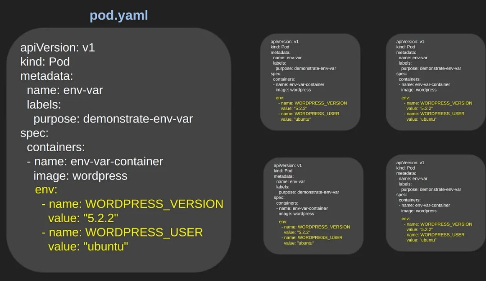
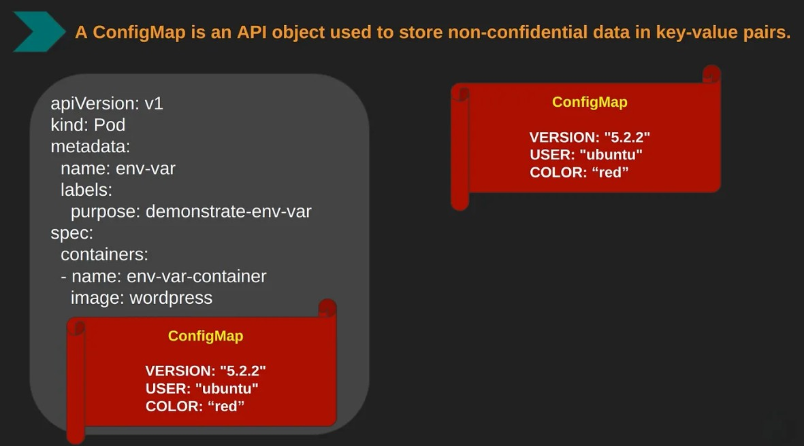
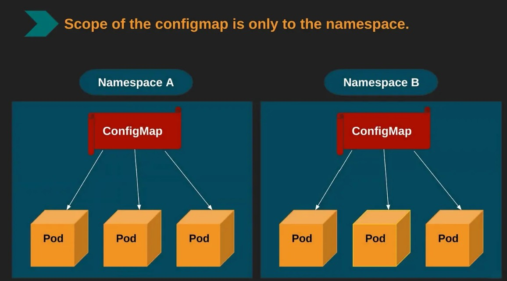
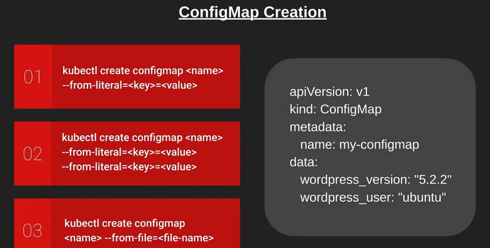
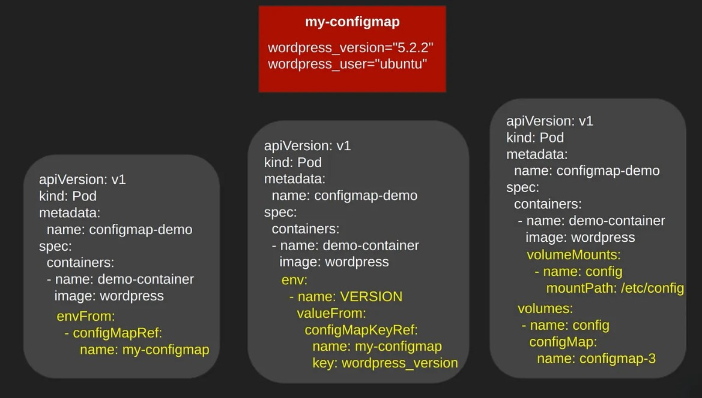

**Issues with Environment Variables:** <br>
Traditionally, environment variables are used to inject configuration settings into application containers. However, this approach has several limitations:<br><br>
&emsp;1.&emsp;**Lack of Flexibility:** Environment variables are tightly coupled with container images. Any change in configuration requires either redeploying the container with new variables or rebuilding the image.<br><br>
&emsp;2.&emsp;**Environment-Specific Challenges:** Managing environment variables for different environments (e.g., dev, test, prod) can be cumbersome, often requiring separate configuration files or deployment scripts.<br><br>
&emsp;3.&emsp;**Scalability:** As the number of applications and environments increases, managing environment variables becomes complex and error-prone.<br><br>
 <br>
**ConfigMaps in Kubernetes: A Centralized Solution**<br>
ConfigMaps address these issues by providing a centralized and decoupled way to manage configuration data.<br><br>
**What are ConfigMaps?**<br><br>
A ConfigMap is a Kubernetes object used to store non-confidential configuration data in key-value pairs.<br>
ConfigMaps help you separate config values from your code and container images. These values can be strings or Base64-encoded binary data.<br>
ConfigMaps are essential for managing configuration settings separately from the application code, making your applications more flexible and portable.<br>
After creating a ConfigMap, the ConfigMap is then stored in Kubernetes cluster. Pods can access the ConfigMap's values as environment variables, command line arguments, or as part of the filesystem volumes.<br><br>
**Why Use ConfigMaps?**<br>
&emsp;•&emsp;**Decoupling Configuration from Code:** ConfigMaps allow you to change configuration settings without rebuilding your container images.<br>
&emsp;•&emsp;**Environment-Specific Configurations:** Easily manage different configurations for various environments (development, staging, production). This eliminates the need for multiple configuration files and reduces the risk of errors.<br>
&emsp;•&emsp;**Centralized Management:** Simplify management of configuration settings by centralizing them in one place.<br><br>
 <br>
 <br>
**Creating ConfigMaps**<br><br>
&emsp;1.&emsp;**Creating a ConfigMap from Literal Values**<br>
&emsp;&emsp;You can create a ConfigMap directly from the command line using literal values.<br>
```hcl
    kubectl create configmap my-config --from-literal=db_host=database.example.com --from-literal=db_port=5432
```
&emsp;2.&emsp;**Creating a ConfigMap from a File**<br>
&emsp;&emsp;ConfigMaps can also be created from configuration files.<br>
Example: `app.properties` <br>
```hcl
    db_host=database.example.com
    db_port=5432
    log_level=DEBUG
```
&emsp;&emsp;To create a ConfigMap from this file:<br>
```hcl
    kubectl create configmap my-config --from-file=app.properties
```
&emsp;3.&emsp;**Creating a ConfigMap from Multiple Files**<br>
&emsp;&emsp;You can create a ConfigMap from multiple files, with each file’s content stored under its filename as a key.<br>
```hcl
    kubectl create configmap my-config --from-file=app.properties --from-file=log.properties
```
&emsp;4.&emsp;**Creating a ConfigMap from a Directory**<br>
&emsp;&emsp;If you have a directory containing multiple configuration files, you can create a ConfigMap from the entire directory.<br>
```hcl
    kubectl create configmap my-config --from-file=config-dir/
```
&emsp;5.&emsp;**Creating a ConfigMap with YAML**<br>
&emsp;&emsp;You can define a ConfigMap in a YAML file and create it using `kubectl apply`.<br>
Example: `configmap.yaml` <br>
```hcl
    apiVersion: v1
    kind: ConfigMap
    metadata:
        name: my-config
    data:
        app.properties: |
            db_host=database.example.com
            db_port=5432
        log_level: DEBUG
```
 <br>
 <br>
&emsp;5.&emsp;**ConfigMap Content:**<br>
&emsp;&emsp;&emsp;*Contains key-value pairs:* `wordpress_version="5.2.2"` and `wordpress_user="ubuntu"`.<br>
&emsp;2.&emsp; **Usage Scenarios:**<br>
&emsp;•&emsp;**Environment Variables (`envFrom`):** The ConfigMap is referenced to inject all key-value pairs as environment variables into the container.<br><br>
&emsp;•&emsp;**Specific Key (`valueFrom`):** A single key (wordpress_version) from the ConfigMap is injected as an environment variable (VERSION).<br><br>
&emsp;•&emsp;**Volume Mount:** ConfigMaps can also be mounted as volumes in your pods, allowing containers to access configuration files directly.<br><br>
**Using Specific Keys from a ConfigMap**<br>
If you only need specific keys from a ConfigMap, you can specify them explicitly.<br>
&emsp;&emsp; **Example: Using Specific Keys as Environment Variables**<br>
```hcl
apiVersion: v1
kind: Pod
metadata:
  name: my-pod
spec:
  containers:
  - name: my-container
    image: my-image
    env:
    - name: DB_HOST
      valueFrom:
        configMapKeyRef:
          name: my-config
          key: db_host
    - name: DB_PORT
      valueFrom:
        configMapKeyRef:
          name: my-config
          key: db_port
```
&emsp;&emsp; **Example: Using Specific Keys as a Volume**<br>
```hcl
apiVersion: v1
kind: Pod
metadata:
  name: my-pod
spec:
  containers:
  - name: my-container
    image: my-image
    volumeMounts:
    - name: config-volume
      mountPath: /etc/config/db_host
      subPath: db_host
  volumes:
  - name: config-volume
    configMap:
      name: my-config
      items:
      - key: db_host
        path: db_host
```
**Advanced ConfigMap Usage**<br><br>
&emsp;&emsp;**Combining ConfigMaps**<br>
&emsp;&emsp;You might need to combine multiple ConfigMaps for a single application. Kubernetes allows you to use multiple ConfigMaps within the same pod.<br>
&emsp;&emsp;**Example: Using Multiple ConfigMaps as Environment Variables**<br>
```hcl
apiVersion: v1
kind: Pod
metadata:
  name: my-pod
spec:
  containers:
  - name: my-container
    image: my-image
    envFrom:
    - configMapRef:
        name: my-config1
    - configMapRef:
        name: my-config2
```
**Updating ConfigMaps**<br>
To update a ConfigMap, you can edit it directly using `kubectl edit`.<br>
```hcl
    kubectl edit configmap my-config
```
Alternatively, you can apply changes from a modified YAML file.<br>
```hcl
    kubectl apply -f updated-configmap.yaml
```
**Using ConfigMaps with Deployments**<br>
In a production environment, you typically use ConfigMaps with Kubernetes Deployments.<br>
**Example: Using ConfigMap in a Deployment**<br>
```hcl
apiVersion: apps/v1
kind: Deployment
metadata:
  name: my-deployment
spec:
  replicas: 3
  selector:
    matchLabels:
      app: my-app
  template:
    metadata:
      labels:
        app: my-app
    spec:
      containers:
      - name: my-container
        image: my-image
        envFrom:
        - configMapRef:
            name: my-config
```
**Best Practices for ConfigMaps**<br><br>
&emsp;1.&emsp; **Version Control**<br>
Maintain versioned ConfigMaps to manage changes and rollbacks effectively. This can be achieved by appending a version number to the ConfigMap name.<br>
```hcl
apiVersion: v1
kind: ConfigMap
metadata:
  name: my-config-v1
data:
  db_host: database.example.com
  db_port: "5432"
```
&emsp;2.&emsp; **Separation of Concerns**<br>
Use separate ConfigMaps for different components of your application. This makes it easier to manage and update configurations without affecting other parts of your application.<br>
```hcl
    kubectl create configmap db-config --from-file=db.properties
    kubectl create configmap api-config --from-file=api.properties
```
&emsp;3.&emsp; **Environment-Specific Configurations**<br>
Create environment-specific ConfigMaps (e.g., `config-dev`, `config-prod`). This allows you to manage configurations for different environments easily.<br>
```hcl
    kubectl create configmap config-dev --from-file=dev.properties
    kubectl create configmap config-prod --from-file=prod.properties
```
&emsp;4.&emsp; **Validation**<br>
Validate the content of your ConfigMaps to avoid errors in your applications. This can be done by using tools like `kubeval` to ensure the syntax and structure are correct.<br>
```hcl
    kubeval configmap.yaml
```
&emsp;5.&emsp; **Security**<br>
While ConfigMaps are not meant for sensitive data, ensure that their access is restricted to necessary components only. Use Role-Based Access Control (RBAC) to control access.<br>
**Example: RBAC Policy**<br>
```hcl
apiVersion: rbac.authorization.k8s.io/v1
kind: Role
metadata:
  namespace: default
  name: configmap-reader
rules:
- apiGroups: [""]
  resources: ["configmaps"]
  verbs: ["get", "list", "watch"]
```

&emsp;6.&emsp; **Use Descriptive Names**<br>
Use descriptive names for your ConfigMaps to easily identify their purpose.<br>
```hcl
    kubectl create configmap app-config --from-file=app.properties
    kubectl create configmap log-config --from-file=log.properties
```
&emsp;7.&emsp; **Keep ConfigMaps Small**<br>
Avoid putting too much data into a single ConfigMap. Split large configurations into multiple ConfigMaps to keep them manageable.<br>
&emsp;8.&emsp; **Document Your ConfigMaps**<br>
Include comments and documentation in your YAML files to describe the purpose and usage of each key-value pair.<br>
```hcl
apiVersion: v1
kind: ConfigMap
metadata:
  name: my-config
data:
  # Database host
  db_host: database.example.com
  # Database port
  db_port: "5432"
```

