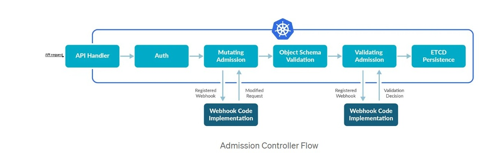
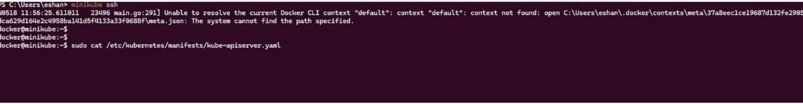
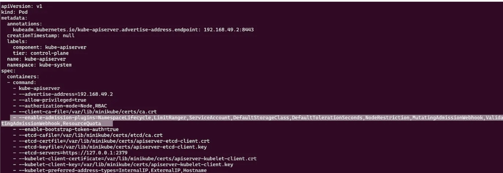
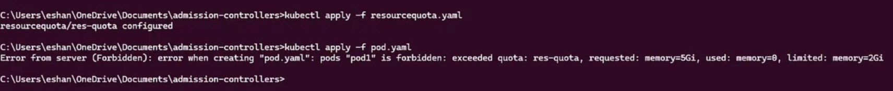
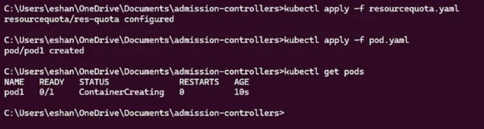

**What Are Admission Controllers?** <br><br>
Kubernetes admission controllers are plugins that help manage how a cluster is used by intercepting API requests. They act like gatekeepers, ensuring that any request to the Kubernetes API server is appropriate and meets the cluster’s policies before it is allowed to proceed.<br><br>
Admission Controllers in Kubernetes ensure that every action in the cluster complies with predefined rules, enhancing security, consistency, and resource management. They do this by possibly modifying requests or validating them to enforce policies before allowing them to proceed.<br>
 <br>
These controllers are compiled and shipped into the `kube-apiserver` binary, and can only be enabled and configured by the cluster administrator using the `--enable-admission-plugins` and `--admission-control-config-file` flags.<br><br>
When you send a request to the Kubernetes API Server — for example:<br>
```hcl
    kubectl apply -f pod.yaml
```
your YAML does **NOT** directly get stored or executed.<br><br>
When a client (such as `kubectl`, a controller, or any application) sends a request to the Kubernetes API server, the request goes through several stages before being persisted to storage:<br><br>

&emsp;1.&emsp;**Authentication** — Verifying the identity of the requester<br>
&emsp;2.&emsp;**Authorization** — Checking if the authenticated user has permission to perform the action<br>
&emsp;3.&emsp;**Decoding** — Converting the request payload into a structured object, setting default values, etc<br>
&emsp;4.&emsp;**Mutating Admission Control** — Making additional modifications to the request payload<br>
&emsp;5.&emsp;**Schema Validation** — Verifying that the request conforms to the expected OpenAPI schema<br>
&emsp;6.&emsp;**Validating Admission Control** — Performing additional validation or policy enforcement<br><br>
**Here’s a simple breakdown of how they work:**<br><br>
&emsp;1.&emsp;**Interception:**<br>
When a request is made to the Kubernetes API server (like creating a new pod), it first goes through an authentication process. Once authenticated, the request reaches the admission controllers.<br><br>
&emsp;2.&emsp;**Two Phases:**<br>
&emsp;•&emsp;**Mutating Phase:** This phase happens first. Controllers can modify the request if needed. For example, they might add default values or inject additional containers into a pod.<br><br>
&emsp;&emsp;**Validating Phase:** This phase follows the mutating phase. Controllers check the request against the cluster’s policies. If the request doesn’t meet the requirements, it can be denied.<br><br>
&emsp;3.&emsp;**Types of Controllers:** <br><br>
&emsp;•&emsp;**Mutating Controllers:** These can change the request. For instance, the Limit Ranger controller can add default resource limits to a pod.<br><
&emsp;•&emsp;**Validating Controllers:** These ensure the request adheres to certain rules. For example, they might check if the resources requested by a pod are within the allowed limits for a namespace.<br><br>
 <br>
 <br>
**Example:**<br>
**Kubernetes Resource Quotas: Validating Pod Resource Requests**<br>
Let’s break down how Kubernetes admission controllers, particularly the `ResourceQuota` controller, work to enforce resource limits within a namespace using a practical example.<br><br>
**Step 1: Define a Resource Quota**<br><br>
First, we define a ResourceQuota to limit the amount of CPU and memory resources that can be used within a namespace.<br>
```hcl
# resource-quota.yaml
apiVersion: v1
kind: ResourceQuota
metadata:
    name: res-quota
spec:
    hard:
    cpu: “0.5”
    memory: 2Gi
```
We apply this ResourceQuota using the following command:<br>
```hcl
    kubectl apply -f resource-quota.yaml
```
This sets a hard limit on the CPU (0.5 cores) and memory (2Gi) that can be requested by pods in the namespace.<br><br>
**Step 2: Define a Pod**<br><br>
Next, we define a pod that requests more resources than allowed by the ResourceQuota.<br>
```hcl
# pod.yaml
apiVersion: v1
kind: Pod
metadata:
 name: pod1
spec:
 containers:
 — name: ubuntu-pod
   image: ubuntu
   command: [“/bin/sh”]
   args: [“-c”, “while true; do echo hello; sleep 20;done”]
   resources:
     requests:
       memory: “5Gi”
       cpu: “500m”
     limits:
       memory: “10Gi”
       cpu: “500m”
```
When we try to create this pod using:<br>
```hcl
    kubectl apply -f pod.yaml
```
 <br>
**Step 3: Validation by the ResourceQuota Controller**<br>
Upon this request, the following sequence occurs:<br>
&emsp;1.&emsp; The request is sent to the Kubernetes API server.<br>
&emsp;2.&emsp; The ResourceQuota admission controller intercepts the request during the validation phase.<br>
&emsp;3.&emsp; It checks if the pod’s requested resources exceed the defined quota.<br>
Given our initial quota (CPU: 0.5, Memory: 2Gi), the pod’s request for 500m CPU and 5Gi memory exceeds the limits.<br><br>
**Expected Error**<br>
Because the requested resources exceed the quota, the admission controller will deny the request, resulting in an error:<br>
```hcl
Error from server (Forbidden): error when creating “pod.yaml”: pods “pod1” is forbidden: exceeded quota: res-quota, requested: cpu=500m, used: cpu=0, limited: cpu=500m
```
**Step 4: Adjust the Resource Quota**<br>
To allow the pod’s creation, we update the ResourceQuota to accommodate the requested resources.<br>
```hcl
# updated resource-quota.yaml
apiVersion: v1
kind: ResourceQuota
metadata:
 name: res-quota
spec:
 hard:
 cpu: “2”
 memory: 5Gi
```
We apply the updated ResourceQuota:<br>
```hcl
    kubectl apply -f updated-resource-quota.yaml
```
**Step 5: Create the Pod Again**<br>
Now, when we try to create the pod again using the same command:<br>
```hcl
    kubectl apply -f pod.yaml
```
 <br>
The `ResourceQuota` controller validates that the requested resources are within the updated limits, and the pod is successfully created.<br><br>
Kubernetes admission controllers, such as the ResourceQuota controller, ensure that resource requests comply with defined policies. Initially, the pod creation failed because the requested resources exceeded the set quota. After updating the ResourceQuota, the pod creation succeeded, demonstrating how admission controllers enforce resource management policies.