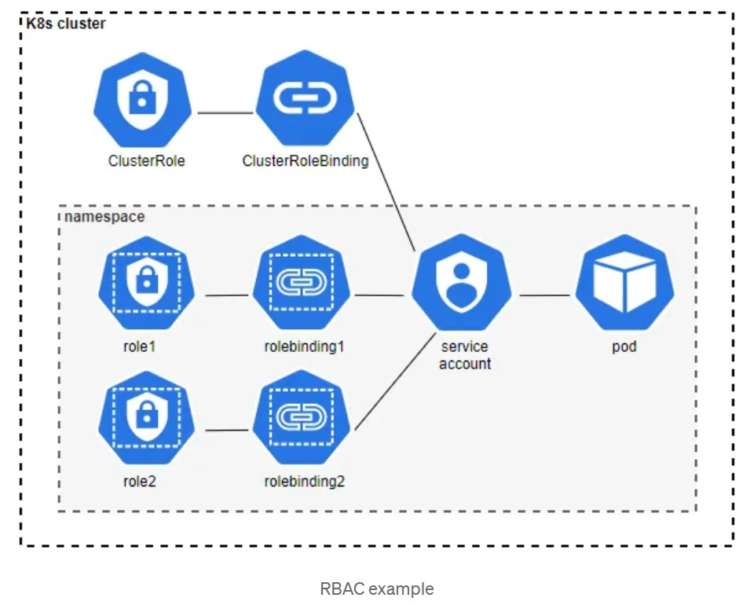
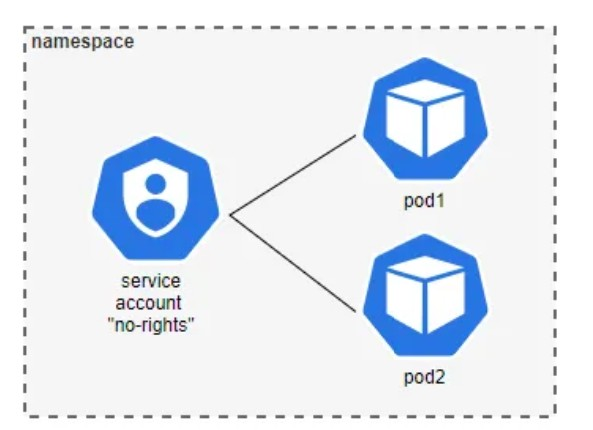

 <br>
**Step 1 — Define a role (Role or ClusterRole) with permissions.**<br>
&emsp;•&emsp;A **Role** exists in the Kubernetes namespace it was created, and can give access to resources in this `namespace`.<br>
A **ClusterRole** exists outside a Kubernetes namespace, and can give access to resources in different namespaces and to `cluster-scoped` resources.<br>
**Step 2 — Create a service account, or use an existing user or group.**<br>
​​​​​​​&emsp;•&emsp;**Service accounts** are Kubernetes objects, which can be created and managed in Kubernetes. Every pod has a service account assigned. As soon as the pod is started, the Service account token is mounted inside the pod, which can then be used to communicate with the kube-apiserver.<br>
&emsp;•&emsp;**Users and groups** are not Kubernetes objects, and have to be managed outside of Kubernetes.
**Step 3: Bind one or more roles to the service account, user or group.**<br>
​​​​​​​&emsp;•&emsp;**RoleBinding** is used to bind a Role to a user or a service account. A RoleBinding exists in the same namespace like the Role it binds.
RoleBindings can also bind a ClusterRole. In that case, the permissions granted by the ClusterRole are valid in the namespace the RoleBinding exists.<br>
&emsp;•&emsp;**ClusterRolesBinding** is used, if the permissions defined in the ClusterRole should be valid for all namespaces.<br>
Now you know how RBAC works. So far so easy, right? ​​​​​​​But let’s discuss this in more detail, because there is more to it than what meets the eye.<br>
**Recommendations for using RBAC**<br><br>
**Less is more — ensure least privileges**<br>
The most important point to consider in regard to RBAC is least privilege. Every service account or user should only have the minimum rights needed for the job to be done.<br><br>
This is especially true for permissions to manage Kubernetes secrets, and for permissions to create new pods (which enables access to secrets, but this is another story).<br><br>
Also be very careful when you assign a `ClusterRole` with a `ClusterRoleBinding` to a `pod`, because this way, you give the `pod` permissions in every namespace in the whole cluster.<br><br>
**Check permissions**<br><br>
&emsp;•&emsp;To check the defined permissions, you can use the following tools:<br><br>
&emsp;•&emsp;To check if a specific user or service account has a specific permission, use the Kubernetes native tool **kubectl auth can-i** <br><br>
Example: check if service account “demo-sa” from namespace “demo” has the right to get secrets in the namespace “demo”<br>
```hcl
    kubectl auth can-i get secrets -n demo --as=system:serviceaccount:demo:demo-sa
    yes
```
&emsp;•&emsp;To check who has a specific permission, use the tool kubectl-who-can from Aqua Security<br>
&emsp;•&emsp;Example: check which service accounts, users or groups can get secrets in the namespace “demo”<br>
```hcl
kubectl who-can get secrets -n demo
ROLEBINDING                    NAMESPACE  SUBJECT    TYPE            SA-NAMESPACE
rb-role-read-secret-demo-sa-1  demo       demo-sa-1  ServiceAccount  demo
```
**Why the default service account is not your friend**<br>
What happens, if you do not define a service account for your pod?
​​​​​​​Then the default service account in the namespace where the pod exists is assigned automatically. No problem, right?<br><br>
Now you need some rights in the Kubernetes cluster, so you bind a role to the default service account. Still no harm done.<br><br>
But what happens, if someone else creates a new pod in the same namespace, without defining a dedicated service account? The new pod also gets the default service account assigned, and by doing so, all the rights from the role that is bound to it. And that is a problem.<br><br>
So do not use the default service account. Instead create a **dedicated service account for pods that need to have permissions in the Kubernetes cluster**.<br>
Service Account example:<br>
`service_account.yaml` <br>
```hcl
apiVersion: v1
kind: ServiceAccount
metadata:
  name: demo-sa
  namespace: demo
```
**No rights needed in the Kubernetes cluster**<br>
If you have one or more pods that do not need to access the kube-apiserver, and you are sure that this will not change in the future, you can do the following.
 <br>
We already talked about not using the default service account, and this is also true if your pod does not need access to the kube-apiserver.<br>
​​​​​​​So instead of using the default service account, create one dedicated service account, which you can assign to all pods that do not need to access the kube-apiserver.<br><br>
​​​​​​​&emsp;•&emsp;The recommendation for pods that need to access the kube-apiserver is still, to create a dedicated service account for every pod.<br>
Then **disable automounting of the service account token**.<br><br>
You can disable automounting of a service account token either in the service account specification, or in the pod specification.<br>
If you specify different automountServiceAccountToken values in the service account specification and the pod specification, the pod specification takes precedence.​​​​​​​<br><br>
​&emsp;•&emsp;Disable automounting of a service account token for a service account:<br>
`disable_automounting_for_sa.yaml` <br>
```hcl
apiVersion: v1
kind: ServiceAccount
metadata:
  name: no-access-sa
automountServiceAccountToken: false
```
​&emsp;•&emsp;Disable automounting of a service account token for a pod: <br>
`disable_automounting_for_pod.yaml` <br>
```hcl
apiVersion: v1
kind: Pod
metadata:
  name: test-pod
spec:
  serviceAccountName: no-access-sa
  automountServiceAccountToken: false
```
**Role definition best practices** <br><br>
Now we have discussed some important points in regard the RBAC. But there is still one missing: the best way to define roles.<br><br>
**Names are important**
The fist recommendation is to give the role a well designed name, which makes it very obvious what the role is used for.<br><br>

​&emsp;•&emsp;E.g. a role that should be able to read secrets, could be named — now please guess what I am going to say — yes, you are right: “read-secrets”.
I think you get the point.<br><br>
**Define roles for different permissions, not for different service accounts** <br>
The second recommendation is to define roles, and bind all needed roles to a service account, instead of creating one role for every service account.<br><br>
Let us illustrate this with the following example:<br>
​&emsp;•&emsp;We want to give two pods the right to get information about other pods and one of the pods the get secrets. The service account of the first pod is “sa1”, and the service account of the second pod is “sa2”.<br>
​&emsp;•&emsp;First, we create the roles “read-pod” and “read-secret”:
`read_pod_role.yaml` <br>
```hcl
apiVersion: rbac.authorization.k8s.io/v1
kind: Role
metadata:
  name: read-pod
  namespace: demo
rules:
- apiGroups: [""]
  resources: ["pods"]
  verbs: ["get", "watch", "list"]
```
`read_secret_role.yaml` <br>
```hcl
apiVersion: rbac.authorization.k8s.io/v1
kind: Role
metadata:
  name: read-secret
  namespace: demo
rules:
- apiGroups: [""]
  resources: ["secrets"]
  verbs: ["get", "watch", "list"]
```
​&emsp;•&emsp;Then we bind the role “read-pods” to both service accounts (sa1 and sa2)
and bind the role “read-secret” to the second service account (sa2):<br>
`read_pod_rolebinding.yaml` <br>
```hcl
apiVersion: rbac.authorization.k8s.io/v1
kind: RoleBinding
metadata:
  name: read-pod
  namespace: demo
subjects:
- kind: ServiceAccount
  name: sa1
  namespace: demo
- kind: ServiceAccount
  name: sa2
  namespace: demo
roleRef:
  kind: Role 
  name: read-pod
  apiGroup: rbac.authorization.k8s.io
```
`read_secret_rolebinding.yaml` <br>
```hcl
apiVersion: rbac.authorization.k8s.io/v1
kind: RoleBinding
metadata:
  name: read-secret
  namespace: demo
subjects:
- kind: ServiceAccount
  name: sa2
  namespace: demo
roleRef:
  kind: Role 
  name: read-secret
  apiGroup: rbac.authorization.k8s.io
```
In the end we check the permissions of the two service accounts:<br>
```hcl
kubectl auth can-i get pods -n demo --as=system:serviceaccount:demo:sa1
yes
kubectl auth can-i get secrets -n demo --as=system:serviceaccount:demo:sa1
no
kubectl auth can-i get pods -n demo --as=system:serviceaccount:demo:sa2
yes
kubectl auth can-i get secrets -n demo --as=system:serviceaccount:demo:sa2
yes
```
**Summary**<br>
In this blog post we discussed what has to be considered when using RBAC in Kubernetes. We talked about the following:<br><br>
​&emsp;•&emsp;Ensure least privilege by giving every service account or user only the minimum rights needed for the job to be done.<br>
​&emsp;•&emsp;Do not use the default service account, instead define a dedicated service account for each of your pods that need to access the kube-apiserver.<br>
​&emsp;•&emsp;If your pods do not need to access the kube-apiserver, define a service account for these pods and disable automounting of the service account token.<br>
​&emsp;•&emsp;Create roles with well-defined names.<br>
​&emsp;•&emsp;Define roles for different permissions, not for different service accounts.
