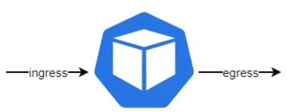
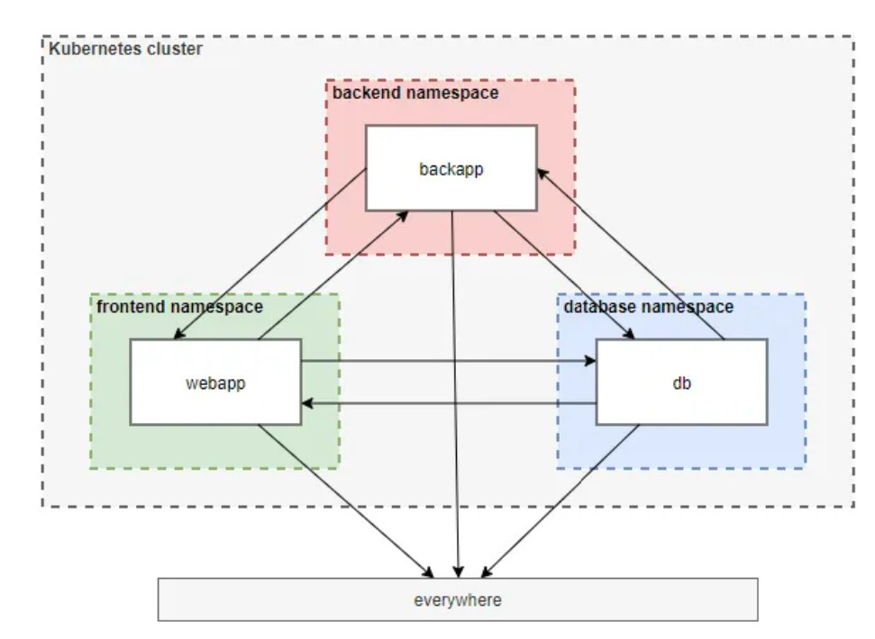
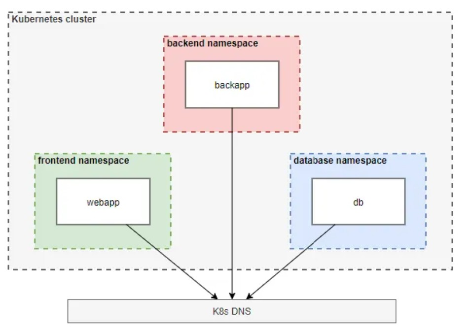
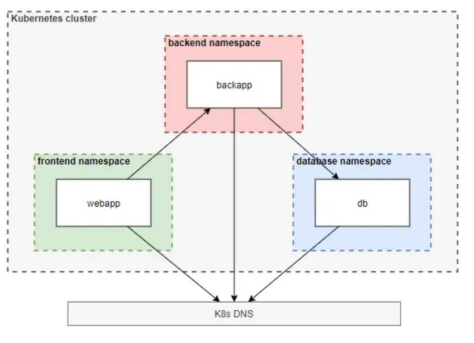

**What is a NetworkPolicy, and why do I need it?**<br><br>
By default, all pods in a Kubernetes cluster can communicate with each other, regardless of the node they exist on or the namespace they're in. This is very convenient from a usability perspective but far from great for security. Because if an attacker could take over a pod without network restrictions, he could connect to any other pod in the same cluster, even to a pod that, e.g. has access to sensitive information.<br><br>
This is where `NetworkPolicies` come into the picture. With `NetworkPolicies`, you can restrict the network flow between pods in a Kubernetes cluster on the IP address or port level, which is precisely what we need.<br><br>
Now let’s discuss some points that are important to know about `NetworkPolicies`.<br>
**A CNI that supports NetworkPolicies is needed**<br><br>
To use NetworkPolicies, you need a Container Network Interface (CNI) that supports Kubernetes NetworkPolicies. Well known CNIs are, e.g., Calico or Cilium.<br><br>
If you use a CNI that does not support NetworkPolicies, you can define them anyway, but they won't have any effect.<br><br>
**NetworkPolicies are namespaced**<br>
The next thing to understand is that a NetworkPolicy is a namespaced resource in Kubernetes.<br><br>
This means that you have to create your NetworkPolicy inside the namespace, where the pod that you want to restrict the network traffic for lives. If you create a NetworkPolicy without defining a namespace, the NetworkPolicy is created in the `“default”` namespace.<br><br>
**NetworkPolicies are additive**<br>
Please note that `NetworkPolicies` are additive. So, if you create a `NetworkPolicy` that allows `pod1` to talk to `pod`2 and another that allows `pod1` to talk to `pod3`, then the two policies are combined. `Pod1` can talk to both `pod2` and `pod3`.<br><br>
**NetworkPolicies have to be defined on both sides** <br><br>
The last thing to consider is that to allow a connection between `pods`, the connection has to be allowed on both sides.
For example, if `pod1` should be allowed to connect to `pod2`, an `egress` policy has to be defined for `pod1`, and for this connection to work, an `ingress` policy has to be defined for `pod2`.<br><br>
**Structure of NetworkPolicy** <br><br>
Now that we know why we need NetworkPolicies and how they work let’s see how a `NetworkPolicy` is created.<br>
`test-network-policy.yaml` <br>
```hcl
piVersion: networking.k8s.io/v1
kind: NetworkPolicy
metadata:
  name: test-network-policy
  namespace: demo
spec:
  # 1
  podSelector:
    matchLabels:
      role: db
  # 2
  policyTypes:
    - Ingress
    - Egress
  # 3
  ingress:
    - from:
        - ipBlock:
            cidr: 172.17.0.0/16
            except:
              - 172.17.1.0/24
        - namespaceSelector:
            matchLabels:
              project: myproject
        - podSelector:
            matchLabels:
              role: frontend
      ports:
        - protocol: TCP
          port: 6379
  # 4
  egress:
    - to:
        - ipBlock:
            cidr: 10.0.0.0/24
      ports:
        - protocol: TCP
          port: 5978
```
**# 1 — podSelector** <br>
The first part in the “spec” section is the podSelector, which defines the pods the NetworkPolicy applies to.<br>
If matchLabels is specified, the NetworkPolicy is valid for all pods in the defined namespace that either<br><br>
&emsp;•&emsp;have a specified label set (like in the example above) or <br>
&emsp;•&emsp;that have the specified name, for example like this:<br>
```hcl
spec:
  podSelector:
    matchLabels:
      kubernetes.io/metadata.name: my-pod
```
It is also possible to define an empty podSelector, which selects all pods in the namespace the NetworkPolicy exists:<br>
```hcl
spec:
  podSelector: {}
```
**# 2 — policyTypes**<br>
 <br>
The second part in the `“spec”` section is the `policyTypes`, which defines the type of the NetworkPolicy. The following settings are possible:<br><br>
&emsp;•&emsp;If both “`-Ingress`” and “`-Egress`” are defined like in the example above, the policy applies to **incoming and outgoing traffic**.<br>
&emsp;•&emsp;If only “`-Ingress`” is specified, the policy only applies to *incoming traffic*.<br>
&emsp;•&emsp;If only “`-Egress`” is specified, the policy only applies to *outgoing traffic*.<br><br>
**3 and 4 — ingress and egress policies**<br><br>
If the policyType “`-Ingress`” was specified, the allowed incoming connections have to be defined in the ingress section. There are two sections: the “`from`” and the “`ports`” section.<br><br>
In the “`from`” section, the following blocks can be specified (either alone or together:<br><br>
*ipBlock:*<br><br>
The block of IP addresses from where connections to the selected pod(s) are allowed. In an ipBlock, IP addresses can be excluded.<br><br>
*namespaceSelector:*<br><br>
The namespace, from where ingoing connections are allowed. If matchLables is specified, the ingress is allowed from namespaces that either<br><br>
&emsp;•&emsp;have a specific **label** set or<br>
&emsp;•&emsp;that have a specific **name**<br><br>
*podSelector:*<br><br>
The pods, from where ingoing connections are allowed. If matchLabels is specified, the ingress is allowed from pods that either<br><br>
&emsp;•&emsp;have a specific **label** set, or<br>
&emsp;•&emsp;that have a specific **name**<br>
&emsp;•&emsp;The `“ports” section` specifies the port to connect to.<br><br>
If the policyType `“-Egress”` was specified, the allowed outgoing connections have to be defined in the `egress` section. There are two sections: the `“to”` and the `“ports”` section.<br><br>
​​​​​​​Regarding every other aspect of the `egress` section, the same is true as for the `ingress` section.<br><br>
To illustrate more in-depth how `ingress` and `egress` policies can be defined, look at the two examples below (I have used an `ingress` policy here, but the same applies to an `egress` policy):<br>
```hcl
ingress: 
    - from:
        - namespaceSelector:
            matchLabels:
              kubernetes.io/metadata.name: frontend
        - podSelector:
            matchLabels:
              app: web
```
```hcl
ingress: 
    - from:
        - namespaceSelector:
            matchLabels:
              kubernetes.io/metadata.name: frontend
          podSelector:
            matchLabels:
              app: web
```
*NOTE:* '-' is missing for `podSelector` in second block. <br>
*Here is impact of using and not using '-'* <br>
In the first example, the `ingress` is allowed for `pods` in the `namespace “frontend”` **OR** `pods` in the `namespace` the `NetworkPolicy` exists that have the label `“app: web”` specified.<br><br>
In the second example, the `ingress` is allowed for `pods` that exist in the `namespace “frontend”` **AND** have the label `“app: web”` specified.<br><br>
The `“-”` in front of the selectors indicates that it is a separate `“from”` element.<br><br>
**NetworkPolicies best practices**<br>
We learned a lot about how to create a NetworkPolicy. In this section, let us discuss some best practices regarding NetworkPolicies. Let’s start!<br><br>
**Deny-all NetworkPolicy**<br>
The first best practice is to create a `“deny-all”` NetworkPolicy.<br>
`network-policy_deny-all.yaml` <br>
```hcl
apiVersion: networking.k8s.io/v1
kind: NetworkPolicy
metadata:
  name: demo-deny-all
  namespace: demo
spec:
  podSelector: {}
  policyTypes:
    - Ingress
    - Egress
  ingress: []
  egress:
    # allow access to Kubernetes DNS:
    - to:
      - namespaceSelector: {}
        podSelector:
          matchLabels:
            k8s-app: kube-dns
      ports:
        - port: 53
          protocol: UDP
```
Because all network traffic is allowed by default, as we learned above, it is a good idea to start with denying all network traffic and then allowing only what is needed.<br><br>
Maybe at this point, you ask yourself the following two questions (as I did when I started to learn about NetworkPolicies):<br><br>
&emsp;1.&emsp;How can this even work if NetworkPolicies are additive and I deny all?<br>
&emsp;2.&emsp;Do I always need a deny-all NetworkPoliciy?<br><br>
Let’s address these two points separately:<<br>><br>
&emsp;1.&emsp;If you look at the deny-all NetworkPolicy, you can see that it is an allow-nothing policy. And adding an allow-nothing policy with a policy that allows something just means something is allowed :)<br><br>
&emsp;2.&emsp;Let’s address the second point if a deny-all policy is needed. A deny-all policy is usually not really needed, but it is best practice to implement one still.<br>
Let’s dig a little deeper here. As soon as any NetworkPolicy is defined for ingress or egress, only the allowed connections are possible for the selected pods. That means, if you have any Ingress and an Egress NetworkPolicy for a pod defined, you won’t need a deny-all NetworkPolicy, because all that is not allowed is denied anyway.
But you should define one nevertheless, to be sure that if, e.g., you remove the Egress NetworkPolicy, the Egress is still denied.<br><br>
One additional thing needs to be addressed regarding the deny-all NetworkPolicy: You must **allow access to the K8s DNS server**. Otherwise, the DNS resolution would no longer be possible.<br><br>
**Block access to the Cloud Provider Metadata API**<br>
The next best practice is to *block access to the cloud provider Metadata API*.<br>
```hcl
apiVersion: networking.k8s.io/v1
kind: NetworkPolicy
metadata:
  name: allow-outgoing-traffic-except-metadata-api-access
  namespace: demo
spec:
  podSelector:
    matchLabels: {}
  policyTypes:
  - Egress
  egress:
  - to:
    - ipBlock:
        cidr: 0.0.0.0/0 # Preferably something smaller here
        except:
        - 169.254.169.254/32
```
Pods can access the cloud provider's Metadata API by default because they inherit the privileges of their Kubernetes node.<br><br>
The cloud Metadata API can contain cloud credentials or provisioning data like Kubelet credentials, which can be used to escalate within the Kubernetes cluster or to other cloud services.<br><br>
The access should be blocked if there is no valid use case for a pod to access the Metadata API. This can be done with a NetworkPolicy.<br><br>
**If no access to the outside is needed …**<br><br>
block all outgoing connections altogether. In that case, you don't need to block the access to the Metadata API extra because it will be co-blocked.<br><br>
**If access to the outside is needed …**<br><br>
just block the access to the cloud provider Metadata API by excluding the Metadata APIs IP address from the allowed IP addresses (see example).
The metadata IP address for all cloud providers is **169.254.169.254**:<br><br>
**Example**:*For simplicity in this example, the Nginx image is used for all pods.* <br><br>
**Step 1: Create the resources for the NetworkPolicy example​**<br>
​&emsp;•&emsp;Create the namespaces<br>
​&emsp;•&emsp;Create the pods<br>
​&emsp;•&emsp;Create the services for the pods<br>
​&emsp;•&emsp;Verify that all created pods and services exist<br>
```hcl
kubectl create ns frontend
kubectl create ns backend
kubectl create ns database
​
kubectl run webapp --image=nginx --labels=app=web -n frontend
kubectl run backapp --image=nginx --labels=app=back -n backend
kubectl run db --image=nginx --labels=app=db -n database
​
kubectl expose pod webapp --port 80 -n frontend
kubectl expose pod backapp --port 80 -n backend
kubectl expose pod db --port 80 -n database
​
kubectl get pod,svc -n frontend
kubectl get pod,svc -n backend
kubectl get pod,svc -n database
```
**Step 2: Verify that the three pods can talk to each other**<br><br>
​&emsp;•&emsp;Wait until the pods are running<br>
​&emsp;•&emsp;Instead of curl to the service names, you can also curl to the service's IP address or the pod's IP address to test the connection.<br>
```hcl
kubectl exec webapp -n frontend -- curl backapp.backend # connection works
kubectl exec webapp -n frontend -- curl db.database # connection works
kubectl exec backapp -n backend -- curl webapp.frontend # connection works
kubectl exec backapp -n backend -- curl db.database # connection works
kubectl exec db -n database -- curl webapp.frontend # connection works
kubectl exec db -n database -- curl backapp.backend # connection works
```
 <br>
**Step 3: Create and apply a “deny-all” NetworkPolicy for all namespaces**<br><br>
Use the example below and adjust the metadata.name and metadata.namespace for the other two namespaces.<br>
`deny-all-networkpolicy.yaml`<br
```hcl
piVersion: networking.k8s.io/v1
kind: NetworkPolicy
metadata:
  name: frontend-deny-all
  namespace: frontend
spec:
  podSelector: {}
  policyTypes:
    - Ingress
    - Egress
  ingress: []
  egress:
    - to:
      - namespaceSelector: {}
        podSelector:
          matchLabels:
            k8s-app: kube-dns
      ports:
        - port: 53
          protocol: UDP
```
Apply and check all NetworkPolicies:<br>
```hcl
kubectl apply -f frontend-deny-all-np.yaml
kubectl apply -f backend-deny-all-np.yaml
kubectl apply -f database-deny-all-np.yaml
​
kubectl get networkpolicy -A
  NAMESPACE   NAME                   POD-SELECTOR   AGE
  backend     backend-np-deny-all    <none>         59s
  database    database-np-deny-all   <none>         10s
  frontend    frontend-np-deny-all   <none>         22s
```
**Step 4: Verify that no connections between the pods are possible anymore**<br><br>
```hcl
kubectl exec webapp -n frontend -- curl backapp.backend # connection does not work
kubectl exec webapp -n frontend -- curl db.database # connection does not work
kubectl exec backapp -n backend -- curl webapp.frontend # connection does not work
kubectl exec backapp -n backend -- curl db.database # connection does not work
kubectl exec db -n database -- curl webapp.frontend # connection does not work
kubectl exec db -n database -- curl backapp.backend # connection does not work
```
 <br>
**Step 5: Create and apply NetworkPolicies that allow the following traffic**<br>
From the webapp pod to the backapp pod:<br><br>
​&emsp;•&emsp;Create a `NetworkPolicy` that selects the webapp pod and allows outgoing traffic (`egress`) to the backapp pod:<br>
`webapp-allow-egress-to-backapp.yaml`<br>
```hcl
apiVersion: networking.k8s.io/v1
kind: NetworkPolicy
metadata:
  name: webapp-allow-egress-to-backapp
  namespace: frontend
spec:
  podSelector: 
    matchLabels:
      app: web 
  policyTypes:
    - Egress
  egress:
    - to:
      - namespaceSelector: 
          matchLabels:
            kubernetes.io/metadata.name: backend
        podSelector:
          matchLabels:
            app: back
```
​&emsp;•&emsp;Create a second NetworkPolicy that selects the backapp pod and allows incoming traffic (ingress) from the webapp pod:<br>
`backapp-allow-ingress-from-webapp.yaml`<br>
```hcl
apiVersion: networking.k8s.io/v1
kind: NetworkPolicy
metadata:
  name: backapp-allow-ingress-from-webapp
  namespace: backend
spec:
  podSelector: 
    matchLabels:
      app: back 
  policyTypes:
    - Ingress
  ingress:
    - from:
      - namespaceSelector: 
          matchLabels:
            kubernetes.io/metadata.name: frontend
        podSelector:
          matchLabels:
            app: web
```
From the back-app pod to the database pod:<br><br>
​&emsp;•&emsp;Create a NetworkPolicy that selects the backapp pod and allows outgoing traffic (egress) to the DB pod:<br>
`backapp-allow-egress-to-db.yaml`<br>
```hcl
apiVersion: networking.k8s.io/v1
kind: NetworkPolicy
metadata:
  name: backapp-allow-egress-to-db
  namespace: backend
spec:
  podSelector: 
    matchLabels:
      app: back 
  policyTypes:
    - Egress
  egress:
    - to:
      - namespaceSelector:
          matchLabels:
            kubernetes.io/metadata.name: database
        podSelector:
          matchLabels:
            app: db
```
​&emsp;•&emsp;Create a second NetworkPolicy that selects the db pod and allows incoming traffic (ingress) from the backapp pod:<br>
`db-allow-ingress-from-backapp.yaml`<br>
```hcl
apiVersion: networking.k8s.io/v1
kind: NetworkPolicy
metadata:
  name: db-allow-ingress-from-backapp
  namespace: database
spec:
  podSelector: 
    matchLabels:
      app: db 
  policyTypes:
    - Ingress
  ingress:
    - from:
      - namespaceSelector: 
          matchLabels:
            kubernetes.io/metadata.name: backend
        podSelector:
          matchLabels:
            app: back
```
Apply and check all NetworkPolicies:<br>
```hcl
ubectl apply -f webapp-allow-egress-to-backapp.yaml
kubectl apply -f backapp-allow-ingress-from-webapp.yaml
kubectl apply -f backapp-allow-egress-to-db.yaml
kubectl apply -f db-allow-ingress-from-backapp.yaml
​
kubectl get networkpolicy -A
  NAMESPACE   NAME                                POD-SELECTOR   AGE
  backend     backapp-allow-egress-to-db          app=back       18s
  backend     backapp-allow-ingress-from-webapp   app=back       27s
  backend     backend-np-deny-all                 <none>         4m7s
  database    database-np-deny-all                <none>         3m18s
  database    db-allow-ingress-from-backapp       app=db         6s
  frontend    frontend-np-deny-all                <none>         3m30s
  frontend    webapp-allow-egress-to-backapp      app=web        39s
```
**Step 6: Verify the connections are possible like they should be** <br>
```hcl
kubectl exec webapp -n frontend -- curl backapp.backend # connection works
kubectl exec webapp -n frontend -- curl db.database # connection does not work
kubectl exec backapp -n backend -- curl webapp.frontend # connection does not work
kubectl exec backapp -n backend -- curl db.database # connection works
kubectl exec db -n database -- curl webapp.frontend # connection does not work
kubectl exec db -n database -- curl backapp.backend # connection does not work
```
 <br>
In this example, we defined very fine-grained NetworkPolicies. We selected the pod a NetworkPolicy applies to via its label and specified the ingress and the egress via the namespace and the label of the pod.<br><br>
An easier way to start with NetworkPolicies is first to create policies on the namespace-level and then improve them over time.<br><br>
​​​​E.g., the db-allow-ingress-from-backapp Networkpolicy from the example, defined on namespace-level, would look like this:<br>
`db-allow-ingress-from-backapp2.yaml`<br>
```hcl
apiVersion: networking.k8s.io/v1
kind: NetworkPolicy
metadata:
  name: db-allow-ingress-from-backapp
  namespace: database
spec:
  # the policy applies to all pods in the "database" namespace
  podSelector: {} 
  policyTypes:
    - Ingress
  ingress:
    - from:
      # the ingress is allowed from all pods in the "backend" namespace
      - namespaceSelector: 
          matchLabels:
            kubernetes.io/metadata.name: backend
```
If you go through the following steps every time you start to create NetworkPolicies for your Kubernetes cluster, you should be fine:​​<br><br>
​&emsp;•&emsp;Step 1 — Ensure that the used Container Network Interface (CNI) supports Kubernetes NetworkPolicies<br>
​&emsp;•&emsp;Step 2 — Create a deny-all NetworkPolicy for every namespace<br>
​&emsp;•&emsp;Step 3 — Create NetworkPolicies for allowed connections<br>
​&emsp;•&emsp;Step 4 — Test the created NetworkPolicies<br>
