# Kubernetes Architecture <br>

**Core Architecture Components Explained** <br>
**1.&emsp; Control Plane (Master Node) Components**<br>
•&emsp;`kube-apiserver:` The front end for the control plane. It processes all inner and outer requests, intercepts traffic, and verifies permissions before modifying the cluster state. <br>
•&emsp;`etcd:` A highly available, secure, and distributed key-value store. It serves as Kubernetes' backup database, holding all configuration data and current state logs. <br>
•&emsp;`kube-scheduler:` The routing brain. It watches for newly created pods that have no assigned node and selects the healthiest physical worker node for them based on CPU, memory, and policy constraints.<br>
•&emsp;`kube-controller-manager:` The operator loop. It runs daemon controllers that constantly track the cluster status (e.g., Node Controller, Job Controller, Deployment Controller) and works to bring the current state closer to your desired state. <br>
•&emsp;`cloud-controller-manager (CCM):` The abstraction layer that decouples your internal cluster logic from external cloud platform services, auto-provisioning physical infrastructure assets like cloud-provider storage volumes or load balancers. <br>
**2. Worker Node Components** <br>
•&emsp;`kubelet:` An agent that runs on every single worker node in the cluster. It registers the node with the master control plane and ensures that the specific containers described in PodSpecs are up, healthy, and running.<br>
•&emsp;`kube-proxy:` A network agent running on each node that maintains network rules on host operating systems. It allows network communication to your pods from inside or outside the cluster.<br>
•&emsp;`Container Runtime:` The underlying software engine responsible for actually running the isolated container processes (e.g., containerd, CRI-O, or Docker Engine).<br>
# Master Node <br>
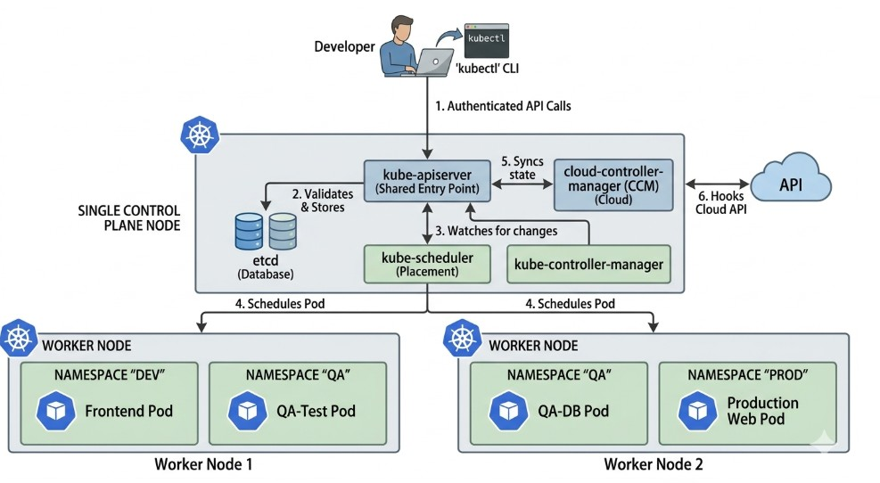
**Control Plane Roles Relative to Namespaces** <br>
•&emsp;`kube-apiserver:` The absolute gatekeeper. Every single `kubectl` request passes here first. When you query a specific namespace, it evaluates your authorization permissions against that unique logical boundary before processing the request.<br>
•&emsp;`etcd:` The single source of truth database. It holds the ultimate structural state configuration for the entire system, mapping exactly which namespace tag belongs to each individual resource definition.<br>
•&emsp;`kube-scheduler:` The matchmaker. It scans for newly configured workloads via the API server and assigns them to an open Data Node based on hardware capacity. The scheduler does not isolate workloads physically by namespace unless you explicitly command it to via affinity policies.<br>
•&emsp;`kube-controller-manager:` The core driver loop. It continuously compares your cluster's current running state against your desired configuration (e.g., ensuring 3 replicas of a production pod remain functional). It operates globally but processes resources namespace-by-namespace. <br>
•&emsp;`cloud-controller-manager (CCM):` The external bridge. It links your cluster to cloud provider APIs (like AWS, Azure, or GCP). For example, when you provision a namespaced `Service` of type `LoadBalancer`, the CCM communicates outward to spin up a physical cloud balancer matching that isolated workload. <br>
**Role-Based Access Control (RBAC)** <br>
To secure your shared multi-tenant cluster (dev, qa, prod), you need to enforce boundaries at two levels: `Access Isolation` using Role-Based Access Control (RBAC) and `Resource Isolation` using Resource Quotas. <br>By default, the Master Node control plane components (`kube-apiserver`, `etcd`, `kube-scheduler`) are entirely locked down and accessible only by cluster administrators or core system processes. Developers interact *only* with the `kube-apiserver`. <br>
**1.&emsp; Restricting Developer Access via RBAC**<br>To prevent a developer working in the dev namespace from viewing or altering things in the prod namespace, you must define a Role (what can be done) and a RoleBinding (who can do it) scoped strictly to that namespace.<br>**Step A: Create a Namespace-Scoped Role**<br>This configuration grants permission to read and write application workloads, but restricts the user from altering administrative cluster infrastructure or crossing over to other namespaces. <br>
```hcl
apiVersion: rbac.authorization.k8s.io/v1
kind: Role
metadata:
  namespace: dev # Boundary limited strictly to the dev namespace
  name: developer-workload-manager
rules:
- apiGroups: [""] # Core API group
  resources: ["pods", "services", "configmaps", "secrets", "persistentvolumeclaims"]
  verbs: ["get", "list", "watch", "create", "update", "patch", "delete"]
- apiGroups: ["apps"] # Apps API group (Deployments, StateFulSets)
  resources: ["deployments", "replicasets", "statefulsets"]
  verbs: ["get", "list", "watch", "create", "update", "patch", "delete"]
```
**Step B: Bind the Role to a User or Group**<br>
This connects your specific developer identity to the namespace role created above. <br>
```hcl
apiVersion: v1
kind: ResourceQuota
metadata:
  name: dev-compute-quota
  namespace: dev # Placed directly inside the dev namespace
spec:
  hard:
    # Compute Restrictions
    requests.cpu: "4"         # Total CPU requests allowed across all dev pods
    requests.memory: 8Gi      # Total Memory requests allowed
    limits.cpu: "8"           # Max absolute CPU spike ceiling
    limits.memory: 16Gi       # Max absolute Memory spike ceiling
    
    # Object Count Restrictions
    pods: "10"                # Max number of concurrent running pods
    services: "5"             # Max services allowed
    persistentvolumeclaims: "4" # Max storage claims allowed

```
# Name Space <br>

# NameSpace Shared Infra <br>
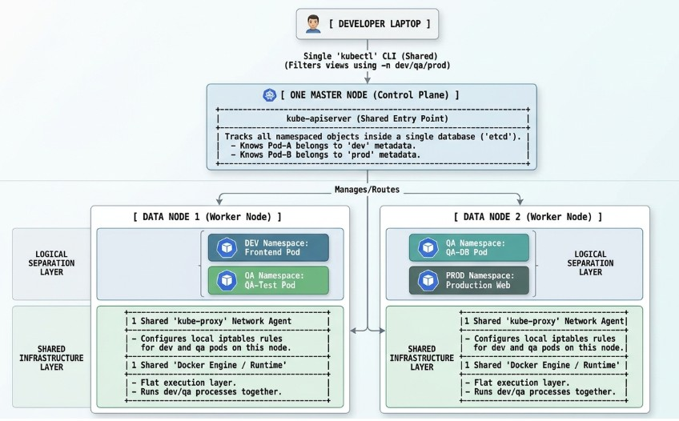
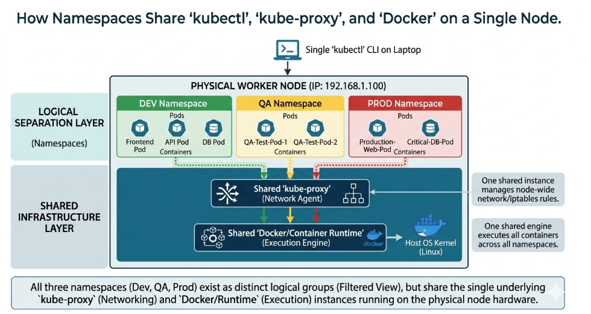
**Kubernetes Networking** <br>
<https://medium.com/@h.stoychev87/kubernetes-networking-a-deep-dive-6081d794e97c> <br>
we’ll walk through the Kubernetes networking model, explore how traffic flows within and outside the cluster, break down key components like Services, CNI plugins, Ingress, network policies, kube-proxy modes, and finish with practical troubleshooting and exam tips. <br><br>
**The Kubernetes Networking Model** <br><br>
Kubernetes enforces three foundational networking principles:<br>

1.&emsp;Pod-to-Pod Communication: Every Pod can communicate directly with any other Pod across nodes, without NAT.<br>
2.&emsp;Node-to-Pod Communication: Nodes can reach every Pod, and Pods can reach nodes, also without NAT.<br>
3.&emsp;Pod IP Consistency: A Pod’s self-IP is identical to what other Pods see externally.<br> <br>
This creates a flat, routable L3 network in which each Pod is a first-class network entity.<br>

•&emsp;Applications can communicate using standard IPs; no port translation is needed. <br>
•&emsp;Simplifies microservices communication.<br>
•&emsp;Enables network policies to be applied at the Pod level.<br><br>
**2.&emsp;The Five Types of Kubernetes Networking**<br><br>
Kubernetes networking addresses four concerns:<br>

1.&emsp;Container-to-Container Networking <br>
2.&emsp;Pod-to-Pod Networking<br>
3.&emsp;Pod-to-Service Networking<br>
4.&emsp;External/Internet-to-Service Networking (Ingress)<br>
5.&emsp;Pod-to-External Networking (Egress)<br><br>
**3.&emsp;Communication Type: Container-to-Container (Inside a Pod)** <br>
•&emsp;`Shared Network Namespace:` Containers within the same pod share the same network namespace, meaning they can communicate with each other via localhost and share the same IP address and port space. <br>
•&emsp;`Inter-Process Communication (IPC):` Containers in a pod can use standard IPC mechanisms like SystemV semaphores or POSIX shared memory to communicate.<br>
•&emsp;`Shared Volumes:` Containers in the same pod can also communicate by reading and writing to shared volumes.<br>
Example:<br>
```hcl
kubernetes_node:
  name: "node-1"
  components:
    pod:
      name: "example-pod"
      ip: "10.244.1.5"
      network_namespace:
        interfaces:
          loopback:
            name: "lo"
            ip: "127.0.0.1"
            purpose: "Container-to-container localhost communication"
          ethernet:
            name: "eth0"
            ip: "10.244.1.5"
            purpose: "Pod network interface for all external communication"
        containers:
          - name: "container-1"
            role: "application"
            image: "nginx"
            listens_on:
              interface: "lo"
              port: 80
          - name: "container-2"
            role: "sidecar"
            action: "curl localhost:80"
            connects_to:
              target: "container-1"
              via: "127.0.0.1"
              protocol: "HTTP"
              description: "Sends GET / requests over the loopback interface"
```
> 📌 NOTE:The BusyBox sidecar continuously sends traffic to the Nginx container using `localhost:80.` <br><br>
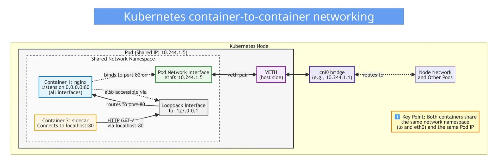
Explanation: <br>
Inside every Kubernetes Pod, and on the host node, you will find several key network interfaces. Each one has a specific purpose in how Pods communicate internally and externally.<br>

Below is an explanation of each:<br>

>> Loopback Interface (lo)<br>

The loopback interface is a virtual network interface inside the Pod.<br>

•&emsp;Allows containers inside the Pod to communicate using localhost (127.0.0.1)<br>
•&emsp;Used for container-to-container communication within the same Pod<br>
•&emsp;Exists in every Linux network namespace<br>
> 📌 NOTE: Anything listening on `127.0.0.1` inside a Pod is accessible only to containers in that same Pod. <br><br>
>> Pod Interface (eth0)<br>

The main network interface inside the Pod.<br>
Every Pod gets one IP address, and that IP is assigned to its eth0 interface.<br>

&emsp;•&emsp;Sends/receives traffic between Pods <br>
&emsp;•&emsp;Communicates with Services, DNS, and external networks<br>
&emsp;•&emsp;Source IP for all traffic leaving the Pod<br><br>
📌 `eth0` holds the Pod IP (e.g., 10.244.1.5).<br>

>> VETH Pair (Virtual Ethernet Pair) <br>

A veth pair is like a virtual cable with two ends:<br>

&emsp;•&emsp;One end stays inside the Pod<br>
&emsp;•&emsp;One end stays on the host (node)<br><br>
📌 It is used to connect the Pod’s network namespace to the host networking system.<br>

Kubernetes CNIs (Calico, Flannel, Cilium, etc.) rely on veth pairs to plug Pods into the cluster network. <br>

>> VETH_P — Pod-Side VETH Interface<br>

The Pod-side end of a veth pair.<br>

&emsp;•&emsp;Connects the Pod to the host<br>
&emsp;•&emsp;Passes traffic from the Pod to the host networking stack<br>
&emsp;•&emsp;Usually named something like `eth0@if123` or similar internally<br><br>
📌 Inside the Pod, traffic exits via `eth0`, but this physically maps to the Pod-side veth interface.<br>

>> VETH_H — Host-Side VETH Interface<br>

The host/node side of the veth pair.<br>

&emsp;•&emsp;Bridges the Pod’s traffic to the CNI plugin (e.g., cni0 bridge)<br>
&emsp;•&emsp;Participates in the node’s routing and CNI overlays<br>
&emsp;•&emsp;Connects Pods to each other across nodes<br>
📌 This is where the Pod attaches to the node network.<br><br>
Its traffic then goes to the CNI bridge (`cni0` or `flannel.1`, etc.) depending on your CNI. <br><br>
Summary
| **Component** | **Location** | **Purpose** | **Example** |
| :--- | :--- | :--- | :--- |
| **lo (loopback)** | Inside Pod |	localhost connectivity between containers |	127.0.0.1 |
| **eth0** | Inside Pod |	Pod’s main network interface |	10.244.1.5 |
| **VETH_P** |	Pod | Pod-side end of veth pair | Connects to host |
| **VETH_H** |	Host |	Host-side end of veth pair | Connects to CNI bridge |

```hcl
Container(s) inside Pod
   |
   |  localhost ↔ lo (127.0.0.1)
   |
   |  external traffic ↔ eth0 (Pod IP)
                     ↕
                VETH_P (Pod end)
                     ↕
                VETH_H (Host end)
                     ↕
                  cni0 (bridge)
```
**4. Communication Type: Pod-to-Pod** <br><br>

&emsp;**IP-Per-Pod Model** <br> <br>
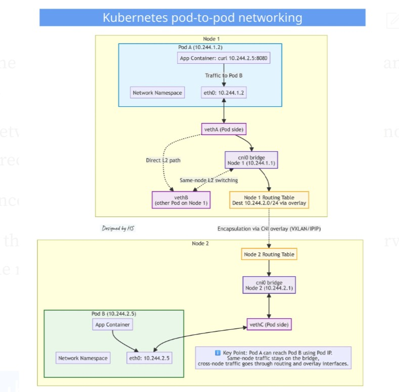
Each pod in Kubernetes is assigned a unique IP address, allowing direct communication between pods without the need for *Network Address Translation (NAT)*. This simplifies networking and ensures that pods can easily find and talk to each other across the cluster. <br><br>
&emsp;**Kube-proxy** <br> <br>
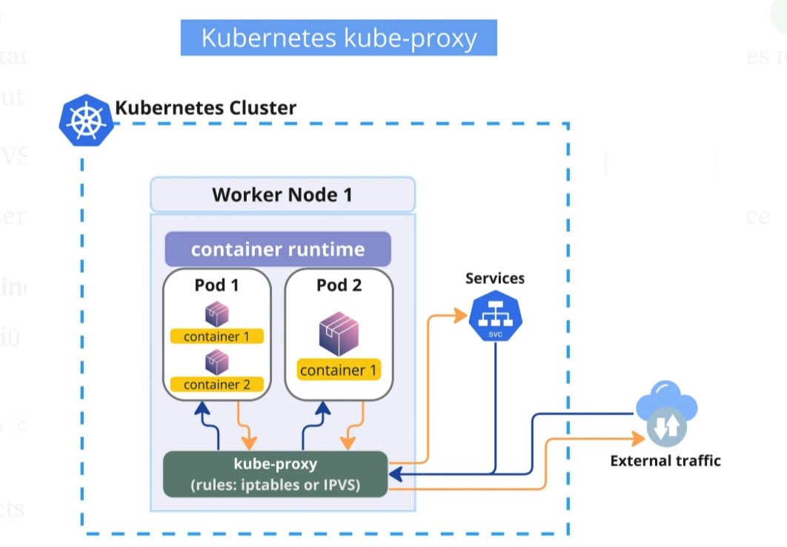
<br>This component runs on each node and manages network rules to allow communication between pods. It handles routing and load balancing for services within the cluster.<br><br>
&emsp;•&emsp;Watches the Kubernetes API server for changes to Services and Endpoints<br>
&emsp;•&emsp;Updates network rules (iptables, IPVS, or nftables) on each node to route traffic correctly<br>
&emsp;•&emsp;Load balances traffic across the pods backing a Service<br>
&emsp;•&emsp;Maintains the virtual IP (ClusterIP) routing so traffic to a Service IP reaches the right pods<br><br>
When you create a Service, kube-proxy ensures that traffic sent to the Service’s ClusterIP gets forwarded to one of the healthy pod IPs behind it. It doesn’t actually proxy the traffic itself in most modes — it sets up rules so the kernel handles the routing directly.<br>

**Three modes:**<br>

&emsp;1.&emsp;iptables mode (most common, still widely used) — Uses iptables rules for routing<br>
&emsp;2.&emsp;IPVS mode — Uses IPVS for better performance with many Services<br>
&emsp;3.&emsp;userspace mode (legacy) — Actually proxies connections in userspace
&emsp;**Тerminology explanation**<br><br>
>> cni0 Bridge<br>

The A `cni0` bridge is a virtual network bridge on the host node.<br>

&emsp;•&emsp;Acts like a virtual switch connecting all Pods on the same node.<br>
&emsp;•&emsp;Receives traffic from the host-side veth interface (VETH_H) of each Pod.<br>
&emsp;•&emsp;Allows same-node Pod-to-Pod communication at Layer 2 (no routing needed).<br>
&emsp;•&emsp;Connects to the node routing system for cross-node traffic.<br><br>
📌 *Think of it as the local hub where Pods “plug in” to communicate with each other or reach the node network.*<br>

>> CNI Overlay (VXLAN/IPIP)<br>

When Pods on different nodes need to talk, traffic leaves the cni0 bridge and is encapsulated by the CNI overlay:<br>

&emsp;•&emsp;VXLAN or IPIP wraps the Pod-to-Pod packet inside a new outer packet.<br>
&emsp;•&emsp;Outer IP addresses are the node IPs, inner IP addresses are the Pod IPs.<br>
&emsp;•&emsp;Sent over the physical network between nodes.<br>
&emsp;•&emsp;Decapsulated on the destination node and delivered to the target Pod via that node’s bridge.<br><br>
📌 *This is how Kubernetes achieves a flat, cluster-wide network, making all Pod IPs reachable across nodes.*<br>

>> Routing Table<br>

Every node has a routing table that decides where packets go:<br><br>
&emsp;•&emsp;Determines whether a Pod IP is local (on the same node) or remote (on another node).<br>
&emsp;•&emsp;Local Pod traffic is sent directly via the cni0 bridge.<br>
&emsp;•&emsp;Remote Pod traffic is sent to the CNI overlay interface (e.g., tunl0 or VXLAN).<br>
&emsp;•&emsp;Ensures packets are properly encapsulated and routed to the destination node.<br><br>
📌 *The routing table is what makes Kubernetes networking transparent to Pods — a Pod only sees a flat IP space, even if its peer is on another node.* <br>

>> iptables<br>

The legacy mechanism kube-proxy uses to implement Kubernetes Services.<br><br>

&emsp;•&emsp;Programs a large set of firewall rules in the Linux kernel.<br>
&emsp;•&emsp;Uses NAT (masquerading) and DNAT to redirect Service IPs (ClusterIPs) to backend Pod IPs.<br>
&emsp;•&emsp;Works by evaluating rules sequentially, which can become slow at scale.<br>
&emsp;•&emsp;Handles connection tracking to ensure packets of the same flow always reach the same Pod.<br>
&emsp;•&emsp;Used by default in many older Kubernetes setups.<br><br>
Think of `iptables` as a long chain of "if-this-then-that" traffic rules.<br>
Powerful, but as the cluster grows, the rule list becomes huge — and that slows things down.<br><br>

>> IPVS<br>

A faster, more scalable alternative to iptables for kube-proxy.<br><br>

&emsp;•&emsp;Implements L4 load balancing directly in the Linux kernel.<br>
&emsp;•&emsp;Uses hashed or round-robin algorithms to distribute traffic across Pods.<br>
&emsp;•&emsp;Builds a dedicated load-balancing table instead of long sequential rule lists.<br>
&emsp;•&emsp;More efficient for large clusters with many Services and Endpoints.<br>
&emsp;•&emsp;Supports health checking and connection persistence.<br><br>
Think of `IPVS` as a purpose-built, kernel-level load balancer:<br>
&emsp;•&emsp;Fast lookups, smarter algorithms, and far more efficient than traversing thousands of iptables rules.<br> <br>
&emsp;**Summary Diagram** <br>
```hcl
Container(s) inside Pod
   |
   |  localhost ↔ lo (127.0.0.1)
   |
   |  external traffic ↔ eth0 (Pod IP)
                     ↕
                VETH_P (Pod-side)
                     ↕
                VETH_H (Host-side)
                     ↕
                  cni0 (bridge)
                     ↕
         Routing Table + Overlay (VXLAN/IPIP)
                     ↕
          Node Network → other nodes → remote Pod
```
**5.&emsp;Communication Type: Pod-to-Service**<br><br>
Because Pods are ephemeral, Services provide a stable virtual IP (ClusterIP).<br><br>
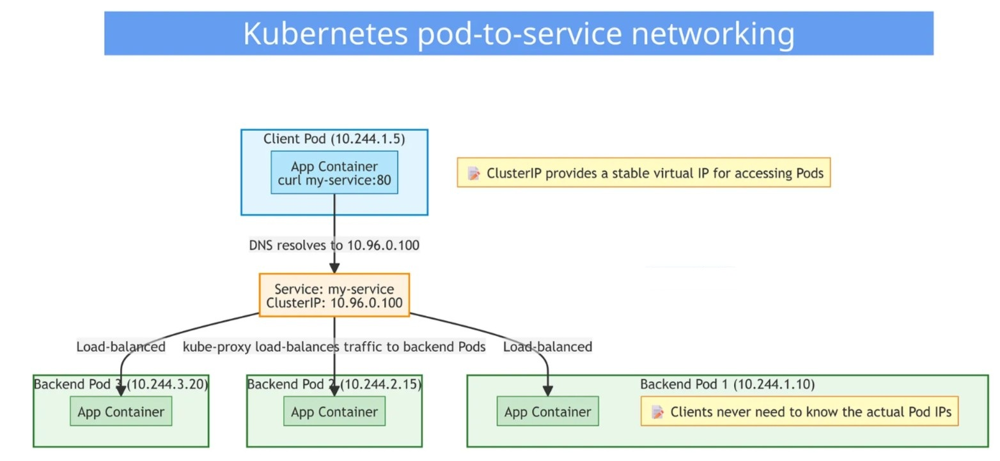
&emsp;**How it works:** <br>

&emsp;1.&emsp;A client Pod resolves my-service via DNS → gets ClusterIP.<br>
&emsp;2.&emsp;Traffic is sent to the ClusterIP.<br>
&emsp;3.&emsp;kube-proxy intercepts and rewrites the packet to a real Pod IP.<br>
&emsp;4.&emsp;The packet reaches the backend Pod.<br>
&emsp;5.&emsp;Response is returned transparently.<br><br>
Summary Diagram <br>
```hcl
Client Pod
   |
   |  curl my-service → ClusterIP (virtual IP)
                     ↕
                  kube-proxy
                     ↕
          Load-balancing & DNAT to backend Pod IPs
                     ↕
           Backend Pod(s) (real Pod IPs)
```
This keeps Pod-to-Service communication simple for applications: Pods just use a single, stable IP, while kube-proxy handles the routing and load balancing behind the scenes.<br><br>
Example:<br>
```hcl
# ---------------------------
# Service
# ---------------------------
---
apiVersion: v1
kind: Service
metadata:
  name: my-service
spec:
  selector:
    app: backend
  ports:
    - protocol: TCP
      port: 80
      targetPort: 8080
  type: ClusterIP
  clusterIP: 10.96.0.100
```

**6.&emsp;Kubernetes Services**<br><br>
Here is the right moment to discuss Kubernetes Services in more detail.<br><br>
A Service in Kubernetes is an abstraction that defines a logical set of Pods and a policy to access them. It provides a stable network endpoint (IP and DNS name) for Pods that may come and go.<br><br>
Pods in Kubernetes are ephemeral — they can be created, destroyed, or replaced. Their IP addresses change dynamically. Services solve this by giving a consistent way to access Pods.<br><br>
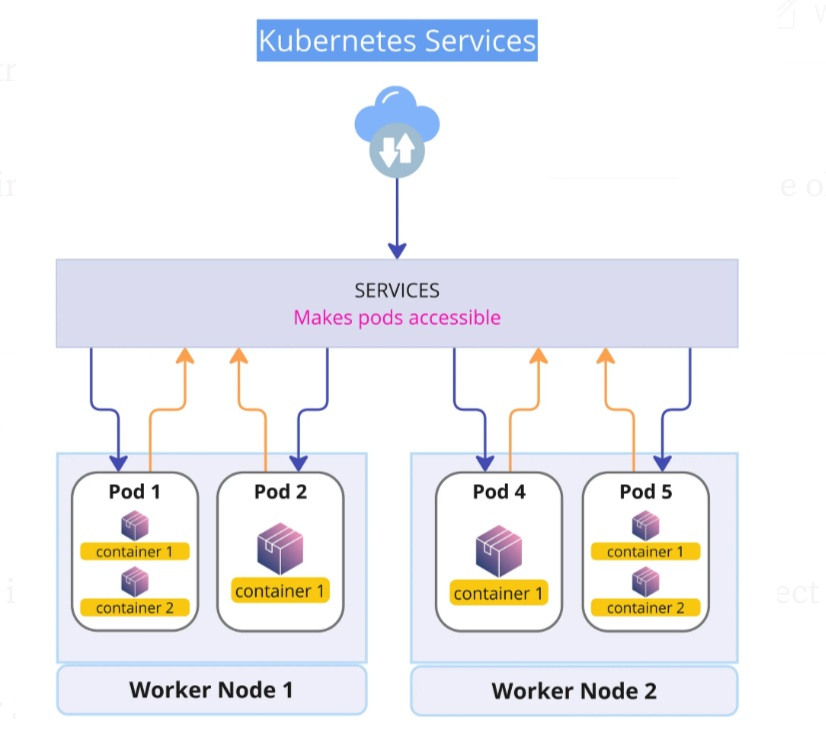<br>
Service types define how the service is exposed, as detailed in the official Kubernetes Service documentation.<br><br>
Explanation:<br>
&emsp;•&emsp;Service is an API resource: It exists in the Kubernetes API as a definable object that you can `kubectl apply`, `kubectl get`, or manage via the API server.<br><br>
&emsp;•&emsp;Service is also an object: When created, it becomes an actual object in etcd, and the Kubernetes control plane manages its lifecycle.<br><br>
So you can think of it as an API resource that represents a Service object in the cluster.<br><br>
&emsp;`kubectl get service my-service` <br>
Here service is the API resource type, and my-service is the object instance.<br><br>
📌 *Summary: Service = API resource type + object instance.* <br>

Service yaml code:<br>
```hcl
apiVersion: v1
kind: Service
metadata:
  name: my-service
spec:
  selector:
    app: my-app
  ports:
    - protocol: TCP
      port: 80        # Service port
      targetPort: 8080 # Pod port
  type: ClusterIP
```
**Stable Cluster IP — ClusterIP:**<br>

&emsp;•&emsp;Each Service gets a fixed IP (ClusterIP) inside the cluster, which does not change, even if Pods are replaced.<br><br>
**Load Balancing:**<br>
&emsp;•&emsp;Services automatically distribute traffic to the backend Pods using `kube-proxy` (via iptables or IPVS).<br><br>
**Service Selector:**<br>
&emsp;•&emsp;The Service selects which Pods to send traffic to using labels. For example, `app=nginx`.<br><br>
**Service Types** <br><br>
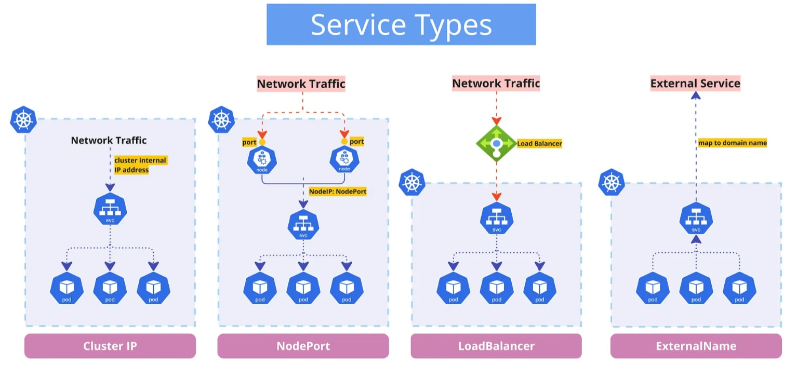<br>
There are several types of Services, each suited for different use cases:<br><br>
&emsp;•&emsp;`ClusterIP:` Exposes the Service on an internal IP within the cluster. This is the default type and is used for communication between services within the cluster.<br>
&emsp;•&emsp;`NodePort:` Exposes the Service on each node’s IP at a static port. This allows external traffic to access the Service.<br>
&emsp;•&emsp;`LoadBalancer:` Exposes the Service externally using a cloud provider’s load balancer.<br>
&emsp;•&emsp;`ExternalName/External Service:` Maps the Service to the contents of the externalName field (e.g., my-app.example.com), allowing you to proxy to an external service.<br><br>
Use the right Service type<br><br>
`externalTrafficPolicy:` Local to preserve source IP and reduce hops:<br>
```hcl
apiVersion: v1
kind: Service
metadata:
  name: my-service
spec:
  externalTrafficPolicy: Local
  selector:
    app: my-app
  ports:
  - port: 80
  ```
**Practical Troubleshooting Commands: Service**<br>
Service Issues:<br>
```hcl
    kubectl get endpoints my-service
    kubectl describe svc my-service
    kubectl logs -n kube-system <kube-proxy-pod>
```
**Practical Troubleshooting Commands: Pod Networking Troubleshooting** <br>
Pod Troubleshoot:<br>
```hcl
    kubectl get pod my-pod -o wide
    kubectl exec pod-a -- ping <pod-b-ip>
    kubectl exec pod-a -- nslookup my-service
    kubectl exec my-pod -- ip addr
```
Pod Cannot Reach Service: <br>
```hcl
    kubectl get svc my-service
    kubectl get endpoints my-service
    kubectl get pods -l app=my-app
    kubectl describe svc my-service
```
Most common causes:<br>

&emsp;•&emsp;Service selector mismatch<br>
&emsp;•&emsp;Pods not Ready<br>
&emsp;•&emsp;kube-proxy misconfiguration<br><br>
**7. Communication Type: External-to-Service (Ingress Networking)**<br><br>
External traffic needs special handling to reach workloads in the cluster.<br>

📌 Ingress (incoming traffic) — Who is allowed to talk to this Pod?<br>
In Kubernetes, there are four main ways an external client can reach a Pod:
| Method | Traffic Type | Exposure Level | Notes |
| :--- | :--- | :--- | :--- |
| NodePort | Any TCP/UDP | Node IP + port |	Simple, static port |
| LoadBalancer | Any TCP/UDP | Cloud LB IP | Production-ready, scalable |
| Ingress | HTTP/HTTPS | Hostname/IP | Path-based routing, TLS |
| Port Forwarding | Any TCP (local) | Localhost only | Debugging, temporary |

**NodePort / LoadBalancer (Any TCP/UDP)**<br><br>
Kubernetes exposes Pods to external clients through Services. The two main types of external traffic are NodePort and LoadBalancer, both supporting any TCP/UDP traffic:<br>
```hcl
    Client → NodePort/LoadBalancer → kube-proxy → ClusterIP → Pod
```
&emsp;**NodePort:** <br>
&emsp;•&emsp;Opens a static port on all cluster nodes.<br>
&emsp;•&emsp;External clients reach a Pod by connecting to <NodeIP>:<NodePort>.<br>
&emsp;•&emsp;kube-proxy forwards the request to the Service’s ClusterIP and then to the backend Pods.<br>
&emsp;•&emsp;Simple to set up, but requires knowing node IPs and ports.<br><br>
&emsp;**LoadBalancer:**<br>
&emsp;•&emsp;Provisions an external load balancer (cloud-specific).<br>
&emsp;•&emsp;Clients connect via the LB’s IP or DNS.<br>
&emsp;•&emsp;Traffic is routed to node NodePorts, then through kube-proxy to Pods.<br>
&emsp;•&emsp;Production-ready, highly available, suitable for large-scale or public-facing applications.<br><br>
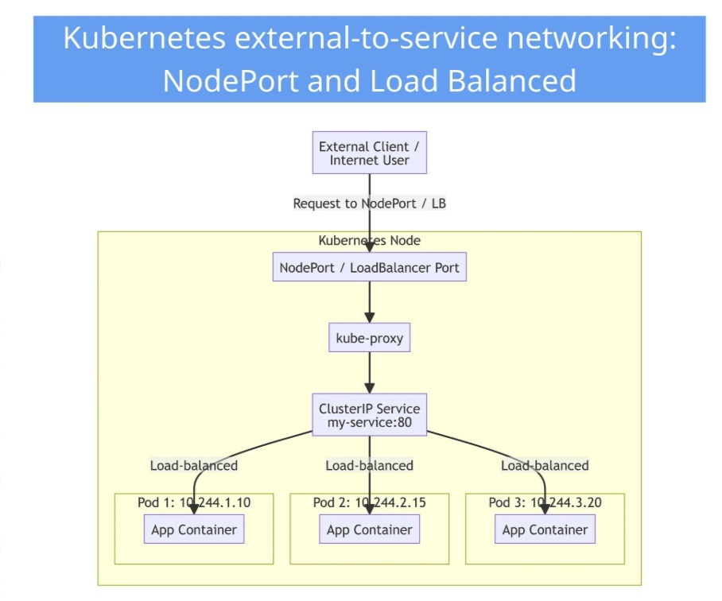<br>
**Ingress (HTTP/HTTPS) communication type— overview**<br><br>
Ingress communication provides HTTP/HTTPS routing from external clients to services inside the cluster.<br><br>
&emsp;•&emsp;An Ingress resource defines routing rules based on hostnames and paths.<br>
&emsp;•&emsp;An Ingress controller (e.g., NGINX, Traefik, HAProxy, Gateway API controller) implements those rules and handles incoming traffic.<br>
&emsp;•&emsp;External traffic arrives at the controller (via NodePort, LoadBalancer, or host network).<br>
&emsp;•&emsp;The controller forwards traffic to the target Service, which then sends it to the backend Pod(s).<br>
&emsp;•&emsp;Ingress operates at the HTTP/HTTPS layer (L7) and can route multiple services via a single external IP or domain.<br><br>
**Ingress Controller — overview** <br>
Overview<br>

An Ingress Controller is a Kubernetes component that manages external access to your cluster’s services.<br>
It acts like a traffic manager or gatekeeper, controlling how HTTP/HTTPS requests from the internet (or other networks) reach the right service inside the cluster.<br>
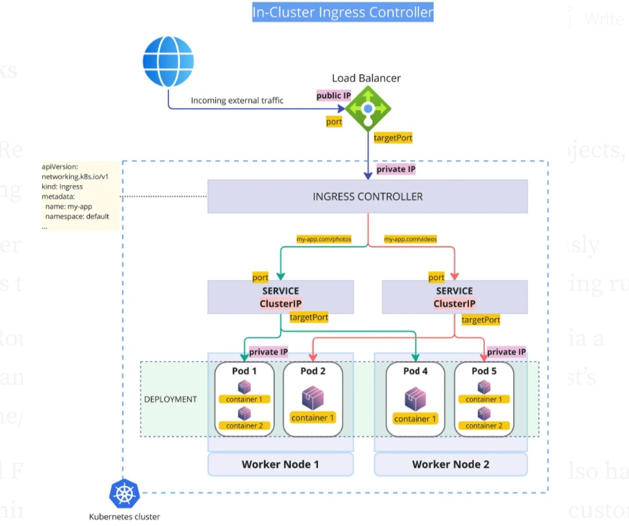<br><br>
How it works<br><br>
&emsp;1.&emsp;Ingress Resources: You define rules in Kubernetes Ingress objects, specifying things like hostnames, paths, and TLS settings.<br>
&emsp;2.&emsp;Controller Watches Ingress: The Ingress Controller continuously monitors these resources and translates them into actual routing rules.<br>
&emsp;3.&emsp;Traffic Routing: When requests arrive at the cluster (usually via a LoadBalancer or NodePort), the controller inspects the request’s hostname/path and forwards it to the correct service.<br>
&emsp;4.&emsp;Optional Features: Many controllers (like NGINX or Traefik) also handle TLS termination, authentication, rate limiting, redirects, and custom headers.<br><br>
Ingress API example<br><br>
One API with 2 Resources: Ingressand IngressClass. This API was set to the Feature-Frozen state.<br>
```hcl
apiVersion: networking.k8s.io/v1
kind: Ingress
metadata:
  name: demo-app
  annotations:
    nginx.ingress.kubernetes.io/rewrite-target: /
spec:
  ingressClassName: nginx
  rules:
  - host: demo.example.com
    http:
      paths:
      - path: /
        pathType: Prefix
        backend:
          service:
            name: demo-service
            port:
              number: 80
```
&emsp;•&emsp;apiVersion / kind — Declares this resource as an Ingress object.<br>
&emsp;•&emsp;metadata — Standard naming and annotations.<br>
&emsp;•&emsp;The example includes an NGINX rewrite annotation (ignored by other controllers).<br>
&emsp;•&emsp;ingressClassName — Specifies which Ingress Controller should handle this Ingress.<br>
&emsp;•&emsp;rules — Defines what host and which URL paths route to which service.<br>
&emsp;•&emsp;backend — Tells Kubernetes to send requests for / on demo.example.com to `demo-service:80`.<br><br>
**Gateway API — overview**<br><br>
The Kubernetes community is rallying behind Gateway API, the next-generation model for cluster ingress.<br><br>
It separates concerns, enables richer routing features, and offers a vendor-neutral, extensible architecture. Teams now have two paths:<br>
&emsp;•&emsp;A Kubernetes-native API (CRDs like `GatewayClass`, `Gateway`, `HTTPRoute`) standardized by the Kubernetes community.<br>
&emsp;•&emsp;It’s not a specific implementation, but a spec that controllers can implement.<br>
&emsp;•&emsp;Ensures configurations are portable across different implementations<br>
&emsp;•&emsp;Examples of controllers implementing Gateway API: Traefik, Istio, Contour, and AGIC (Azure Gateway Ingress Controller).<br><br>
**Gateway API example** <br><br>
Gateway API is built around three core resources: `GatewayClass`, `Gateway`, and `HTTPRoute`—the essential building blocks for configuring modern Kubernetes traffic management.<br>

>> GatewayClass

Defines the type of Gateway your controller will create. Usually provided by the controller:<br>
```hcl
apiVersion: gateway.networking.k8s.io/v1
kind: GatewayClass
metadata:
 name: traefik
spec:
 controllerName: traefik.io/gateway-controller
```
>> Gateway <br>
Represents the actual entry point into your cluster (like a load balancer).<br>
```hcl
apiVersion: gateway.networking.k8s.io/v1
kind: Gateway
metadata:
  name: web-gateway
spec:
  gatewayClassName: traefik
  listeners:
  - name: http
    protocol: HTTP
    port: 80
    allowedRoutes:
      namespaces:
        from: Same
```
>> HTTPRoute<br>
Defines the routing rules for your services.<br>
```hcl
apiVersion: gateway.networking.k8s.io/v1
kind: HTTPRoute
metadata:
  name: demo-route
spec:
  parentRefs:
  - name: web-gateway
  rules:
  - matches:
    - path:
        type: PathPrefix
        value: /
    backendRefs:
    - name: demo-service
      port: 80
```
**Ingress Controller (API) vs Gateway API**<br>
⚠️ Important clarification

The *Ingress API* itself is *not deprecated and is not scheduled for removal*.
However, it is *feature-frozen*, meaning no new capabilities will be added, and innovation is happening in the Gateway API instead.<br><br>
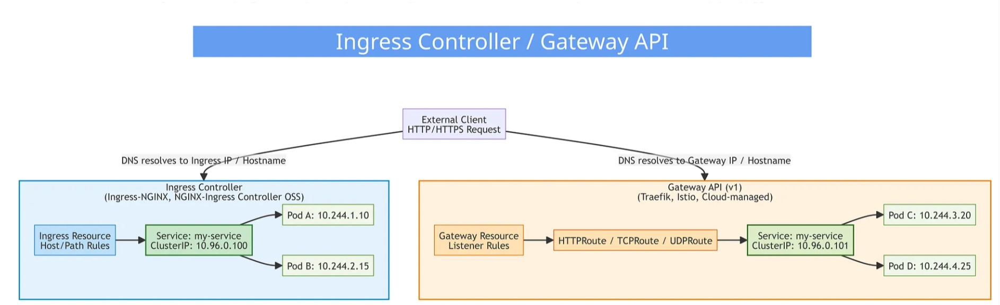<br><br>
📌 Ingress is simple but limited and vendor-fragmented. Gateway API is modular, powerful, cloud-native, and a long-term replacement. <br>
| Feature | Ingress API | Gateway API |
| :--- | :--- | :--- |
| Primary Resource | Ingress | GatewayClass, Gateway, HTTPRoute |
| Design Model | Single resource mixing rules + entrypoint | Modular, decoupled architecture |
| Extensibility | Limited; relies on annotations | Rich, native extension points |
| Vendor Consistency | Low — every controller uses different annotations | High — standardized across vendors |
| Advanced Routing | Minimal (paths/hosts) | Headers, methods, weight-based traffic, mTLS, policies |
| Separation of Concerns | Weak | Strong: infra team manages Gateways, app teams manage Routes |
| Cloud Provider Support | Add-ons (NGINX, AGIC, ALB Ingress) | First-class: AKS (with AGC), EKS, GKE, Traefik, Istio, Contour |
| Future Direction | Being phased out (Ingress-NGINX EOL 2026) | Long-term Kubernetes networking standard |
| Best For | Simple routing, test and labs | Modern, scalable, multi-team environments |

**8. Communication Type: Pod-to-External (Egress)** <br><br>
Allows containers inside Pods to reach resources outside the cluster (e.g., APIs, databases, websites).<br><br>
📌 Egress (outgoing traffic) — Who is this Pod allowed to talk to? <br>
.jpg) <br>
**How Egress works*-* <br><br>
&emsp;•&emsp;Traffic from a Pod exits via its eth0 interface.<br>
&emsp;•&emsp;It goes through the veth pair to the host network namespace.<br>
&emsp;•&emsp;The Pod’s traffic is routed to the node’s routing table. <br>
&emsp;•&emsp;For clusters using NAT (default in most CNI plugins), the source IP of the Pod is masqueraded to the node’s IP. Most CNIs (Calico, Flannel, Cilium) handle egress NAT automatically. Without NAT, Pods would need globally routable IPs to access external networks.<br>
&emsp;•&emsp;Traffic leaves the node via the physical NIC to the internet.<br>
&emsp;•&emsp;Return traffic is automatically routed back to the Pod using connection tracking.<br>
&emsp;•&emsp;Egress can be controlled using NetworkPolicies or specialized egress gateways/proxies.<br><br>
**Common Egress Use Cases**<br><br>
&emsp;•&emsp;Pulling Images or Artifacts: Pods often need to pull images from container registries (Docker Hub, GCR, ECR, etc.) when starting. CI/CD pipelines or init containers may fetch code or artifacts from external sources.<br>
&emsp;•&emsp;Accessing External APIs: Many applications consume third-party services: payment gateways, SaaS APIs, cloud services, etc.<br>
&emsp;•&emsp;Downloading Updates or Dependencies: Pods may need to install libraries, update packages, or fetch data from the internet (examples: `apt-get`, `npm install`, `pip install`).<br>
&emsp;•&emsp;Telemetry and Monitoring: Sending logs, metrics, or traces to external monitoring services (Datadog, Prometheus remote write, Sentry, etc.).<br>
&emsp;•&emsp;DNS Resolution: Even internal cluster DNS often requires external access to resolve certain domains.<br><br>
**9. Container Networking and CNI Plugins** <br><br>
Kubernetes does not provide networking by itself.
CNI plugins handle Pod IP allocation, routing, and network policy enforcement.<br>

You always need a CNI when running Kubernetes — because the Container Network Interface (CNI) is what gives Pods their IPs, connects them to the node, and enables Pod-to-Pod and Pod-to-Service networking. Why is CNI needed?<br>

&emsp;•&emsp;Create Pod network namespaces<br>
&emsp;•&emsp;Attach veth pairs<br>
&emsp;•&emsp;Assign Pod IPs<br>
&emsp;•&emsp;Handle Pod routing<br>
&emsp;•&emsp;Enable overlay networking (if required)<br><br>
**CNI Overlay vs Flat** <br><br>
CNI Overlay<br>

&emsp;•&emsp;Uses encapsulation (VXLAN, IPIP) to create a virtual network across nodes.<br>
&emsp;•&emsp;Pods can communicate with any other Pod in the cluster, regardless of which node they are on.<br>
&emsp;•&emsp;Node IPs carry the traffic, Pod IPs remain the same inside the cluster.<br>
&emsp;•&emsp;Pros: Easy multi-node communication, cluster-wide flat IPs.<br>
&emsp;•&emsp;Example: Flannel VXLAN, Calico VXLAN.<br><br>
**CNI Flat / Non-Overlay** <br>
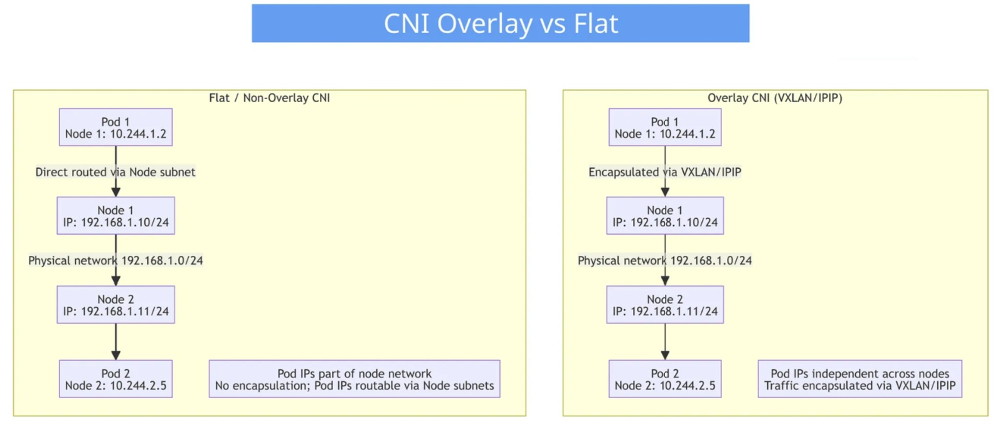 <br>
&emsp;•&emsp;Pods are directly connected to the underlying network (VPC/VNet or node subnet).<br>
&emsp;•&emsp;No encapsulation; routing happens via standard IP routing.<br>
&emsp;•&emsp;Pros: Less overhead, better performance.<br>
&emsp;•&emsp;Cons: Requires subnet planning; Pod IPs must not overlap.<br>
&emsp;•&emsp;Example: Azure CNI “bridged” or “transparent” mode.<br><br>
**Native CNI Plugins (Open-Source / Self-managed)** <br><br>
These are typical OSS networking implementations that run entirely inside the cluster.<br>
CLI_Plugins.jpg) <br><br>
**Calico:**<br>
&emsp;•&emsp;Layer 3 routing with BGP<br>
&emsp;•&emsp;Most advanced NetworkPolicy support<br>
&emsp;•&emsp;Overlay & non-overlay modes<br>
&emsp;•&emsp;Great for large clusters<br><br>
**Flannel:**<br>
&emsp;•&emsp;Simple and popular for learning<br>
&emsp;•&emsp;VXLAN or host-gw backends<br>
&emsp;•&emsp;Limited policy support<br><br>
**Cilium:**<br>
&emsp;•&emsp;eBPF-powered networking<br>
&emsp;•&emsp;L3–L7 observability and security<br>
&emsp;•&emsp;Service mesh features built in<br>
&emsp;•&emsp;Extremely performant<br><br>
**Choose the right CNI** <br><br>
Cluster Size Recommended CNI:<br><br>
&emsp;•&emsp;Nodes < 50: Flannel<br>
&emsp;•&emsp;Nodes 50–500: Calico or Cilium<br>
&emsp;•&emsp;Nodes > 500: Cilium Multi-cloud<br><br>
**Cloud-Managed CNI (Provider-Integrated)**<br><br>
These CNIs are built into cloud platforms like AWS, Azure, GCP, and integrate deeply with cloud networking.<br><br>
&emsp;•&emsp;AWS VPC CNI<br>
&emsp;•&emsp;Azure CNI<br>
&emsp;•&emsp;GCP VPC-Native (Alias IPs)<br>
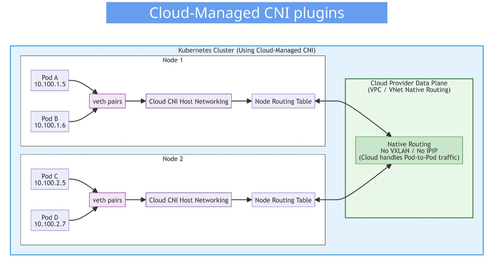 <br><br>
**Cloud CNI key points:**<br><br>
&emsp;•&emsp;The cloud provider (AWS/Azure/GCP) handles the Pod networking.<br>
&emsp;•&emsp;No VXLAN/IPIP overlays inside the nodes.<br>
&emsp;•&emsp;Pod IPs are real IPs inside the VPC (AWS) / VNet (Azure).<br>
&emsp;•&emsp;Pod-to-Pod traffic across nodes stays native (fast, no encapsulation).<br><br>
**10. DNS in Kubernetes**<br><br>
Kubernetes uses CoreDNS for service discovery and service mesh integration. CoreDNS is the default DNS server since K8s 1.13<br><br>
&emsp;•&emsp;Service DNS: `<service-name>.<namespace>.svc.cluster.local` <br>
&emsp;•&emsp;Pod DNS (optional): `<pod-ip-with-dashes>.<namespace>.pod.cluster.local`<br><br>
**Key points:**<br>
&emsp;•&emsp;Pod-to-Service resolution uses virtual IPs<br>
&emsp;•&emsp;Headless services allow direct Pod-to-Pod communication<br>
&emsp;•&emsp;kube-dns service name kept for compatibility<br>
&emsp;•&emsp;DNS queries are cached for 30 seconds by default<br>
&emsp;•&emsp;Search domains are added automatically to the short name<br><br>
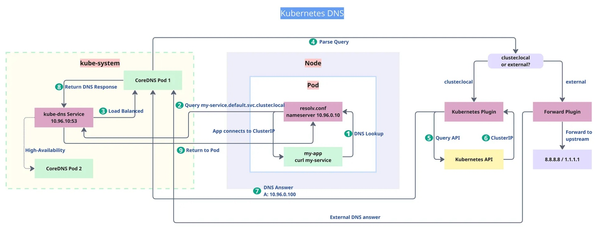 <br><br>
&emsp;1.&emsp; DNS Lookup: The application inside a Pod performs a DNS lookup (e.g., `curl my-service`). The pod reads `/etc/resolv.conf`.<br>
&emsp;2.&emsp; Query to kube-dns: The Pod sends the DNS request to the ClusterIP of CoreDNS (`10.96.0.10:53`).<br>
&emsp;3.&emsp; Load Balanced: The request is load-balanced across CoreDNS Pods through the `kube-dns` Service.<br>
&emsp;4.&emsp; Parse Query: CoreDNS receives and parses the request.<br>
&emsp;5.&emsp; Kubernetes Plugin Query: If the query ends in `.cluster.local`CoreDNS sends an API request to the Kubernetes API.<br>
&emsp;6.&emsp; ClusterIP Lookup: The Kubernetes API returns the ClusterIP for the requested Service.<br>
&emsp;7.&emsp; DNS Answer: CoreDNS generates the DNS response (e.g., `A 10.96.0.100`).<br>
&emsp;8.&emsp; Return DNS Response: CoreDNS returns the answer through the `kube-dns` Service.<br>
&emsp;9.&emsp; Returned to Pod: The Pod receives the DNS answer and then connects to the resolved Service IP.<br><br>
**Practical Troubleshooting Commands**<br>
&emsp;.&emsp;Use nslookup/dig in debug pods to troubleshoot<br>
CoreDNS Troubleshooting:<br>
```hcl
    kubectl get pods -n kube-system -l k8s-app=kube-dns
    kubectl logs -n kube-system -l k8s-app=kube-dns
    kubectl run debug --rm -it --image=busybox -- nslookup kubernetes.default
```
**DNS Resolution Fails:**<br><br>
```hcl
    kubectl get pods -n kube-system -l k8s-app=kube-dns
    kubectl exec my-pod -- cat /etc/resolv.conf
    kubectl exec my-pod -- nslookup kubernetes.default
```
Often caused by:<br>
&emsp;•&emsp;CoreDNS crashloop<br>
&emsp;•&emsp;Wrong cluster DNS IP<br>
&emsp;•&emsp;Node firewall rules<br><br>
**11. Network Policies: Securing Pod Communication** <br><br>
Kubernetes Network Policies are firewall rules for Pods.<br>
&emsp;•&emsp;They define which Pods or external sources are allowed to talk to each other over the network. Without them, everything can talk to everything inside the cluster — wide open.<br><br>
Network Policies let you change that by expressing rules like:<br>
&emsp;•&emsp;“Only backend Pods may access the database.”<br>
&emsp;•&emsp;“Deny all external traffic except to the frontend.”<br>
&emsp;•&emsp;“Allow backend to send traffic to database, but not the other way around.”<br>
&emsp;•&emsp;They work at Layer 3/4 (IP + port), not Layer 7 (HTTP, gRPC, etc.).<br>
&emsp;•&emsp;By default, all traffic is allowed.<br>
&emsp;•&emsp;Network Policies enforce zero-trust networking inside a Kubernetes cluster.<br>
&emsp;•&emsp;The CNI plugin programs the OS-level firewall (iptables, eBPF, nftables, etc.). They rely on the CNI plugin (Calico, Cilium, Azure CNI, etc.) to apply the actual rules on the node.<br><br>
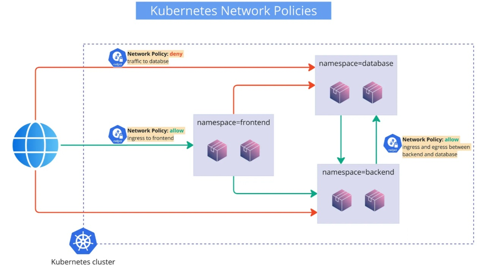 <br><br>
Network policy YAML, stored on API server:<br>
```hcl
# -----------------------------
# Namespace: frontend
# -----------------------------
apiVersion: v1
kind: Namespace
metadata:
  name: frontend
---
apiVersion: networking.k8s.io/v1
kind: NetworkPolicy
metadata:
  name: allow-ingress-to-frontend
  namespace: frontend
spec:
  podSelector: {}           # applies to all Pods in frontend namespace
  policyTypes:
    - Ingress
  ingress:
    - from:
        - ipBlock:
            cidr: 0.0.0.0/0     # allow from external/internet
      ports:
        - protocol: TCP
          port: 80

# -----------------------------
# Namespace: backend
# -----------------------------
apiVersion: v1
kind: Namespace
metadata:
  name: backend
---
apiVersion: networking.k8s.io/v1
kind: NetworkPolicy
metadata:
  name: backend-allow-db
  namespace: backend
spec:
  podSelector: {}                   # all backend Pods
  policyTypes:
    - Egress
  egress:
    - to:
        - namespaceSelector:
            matchLabels:
              name: database       # allow traffic to DB namespace
      ports:
        - protocol: TCP
          port: 5432               # example db port
---
apiVersion: networking.k8s.io/v1
kind: NetworkPolicy
metadata:
  name: backend-allow-ingress-from-db
  namespace: backend
spec:
  podSelector: {}                   # all backend Pods
  policyTypes:
    - Ingress
  ingress:
    - from:
        - namespaceSelector:
            matchLabels:
              name: database
      ports:
        - protocol: TCP
          port: 8080               # example backend port

# -----------------------------
# Namespace: database
# -----------------------------
apiVersion: v1
kind: Namespace
metadata:
  name: database
  labels:
    name: database                  # required for namespaceSelector matching
---
apiVersion: networking.k8s.io/v1
kind: NetworkPolicy
metadata:
  name: deny-external-to-database
  namespace: database
spec:
  podSelector: {}                   # applies to all DB Pods
  policyTypes:
    - Ingress
  ingress:
    - from:
        - namespaceSelector:
            matchLabels:
              name: backend        # allow ONLY backend
      ports:
        - protocol: TCP
          port: 5432               # example DB port
  # No rule for external means external traffic is denied by default
```
This policy:<br>

&emsp;•&emsp;🚫 Deny external → database: `deny-external-to-database NetworkPolicy`<br>
&emsp;•&emsp;✅ Allow external → frontend: `allow-ingress-to-frontend`<br>
&emsp;•&emsp;🔁 Allow backend ↔ database: Two policies: `backend-allow-db + backend-allow-ingress-from-db`<br>
&emsp;•&emsp;Namespaces labeled frontend, backend, databaseNamespace objects<br><br>
**How You Define Traffic Rules**<br><br>
Policies select two things:<br><br>
&emsp;•&emsp;The Pods the policy applies to:<br>
```hcl
podSelector:
  matchLabels:
    app: backend
```
&emsp;•&emsp;Who is allowed (or not allowed) to reach them: namespaceSelector, podSelector, ipBlock:<br>
```hcl
from:
  - namespaceSelector:
      matchLabels:
        name: frontend
  - ipBlock:
      cidr: 10.0.0.0/16
```
**Practical Troubleshooting Commands** <br>
NetworkPolicy Debugging:<br>
```hcl
    kubectl get networkpolicies --all-namespaces
    kubectl describe networkpolicy my-policy
    kubectl run test --rm -it --image=busybox -- sh
```
NetworkPolicy Blocking Traffic:<br>
```hcl
    kubectl get networkpolicies -A
    kubectl describe networkpolicy my-policy
    kubectl get pods --show-labels  
```
**12. Kubernetes End-to-End Traffic Flow**<br><br>
&emsp;**Request flow from client to Pod and back** <br><br>
Here’s a short overview explaining how end-to-end traffic flows in a Kubernetes cluster, from the client request all the way to the Pod and back.<br><br>
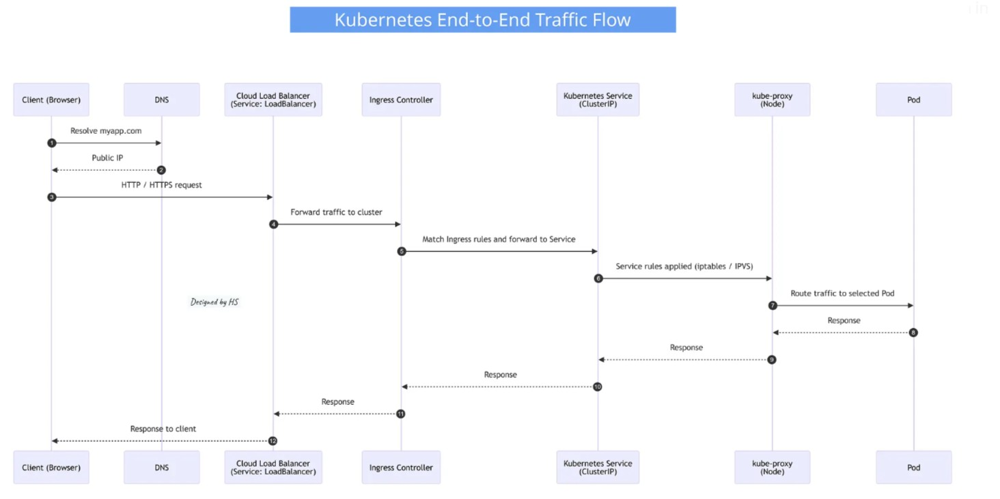 <br><br>
&emsp;1.&emsp; DNS resolution:<br>
&emsp;&emsp;`myapp.com resolves to a public IP`. <br>
&emsp;2.&emsp; Cloud Load Balancer:<br>
&emsp;.&emsp;The public IP belongs to a cloud load balancer (e.g., Azure Load Balancer) created by a Service of type LoadBalancer.<br>
&emsp;.&emsp;The LB forwards incoming traffic to the Ingress Controller Pods running in the cluster.
Health probes ensure traffic is only sent to healthy nodes running the Ingress Controller.<br><br>
&emsp;3.&emsp; Ingress Controller / Gateway:<br>
&emsp;.&emsp;The Ingress Controller inspects the HTTP(S) request, matches it against Ingress rules (host/path), and determines the target Kubernetes Service.<br><br>
&emsp;4.&emsp; Service-to-Pod routing:<br>
The Ingress Controller forwards traffic to the target Service.<br>
>> Optional nuance:<br>

&emsp;.&emsp;kube-proxy on the nodes usually handles routing traffic from the Service to one of its Pods.<br>
&emsp;However, some Ingress Controller implementations can bypass kube-proxy and directly reach Pod endpoints (e.g., via IPVS mode or direct endpoint resolution), improving efficiency.<br><br>
5. Pod processing:<br>
&emsp;.&emsp;The Pod receives the request, processes it, and generates the response.<br>
6. Response path:<br>
&emsp;.&emsp;The response travels back through the same path: Pod → Service → Ingress Controller → cloud LB → client.