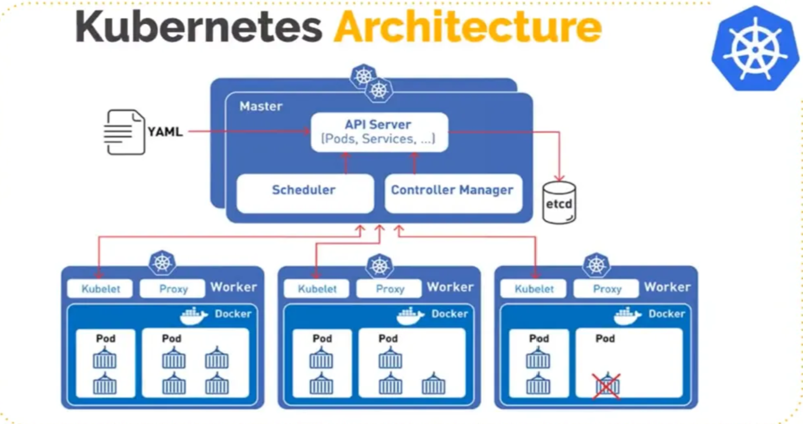
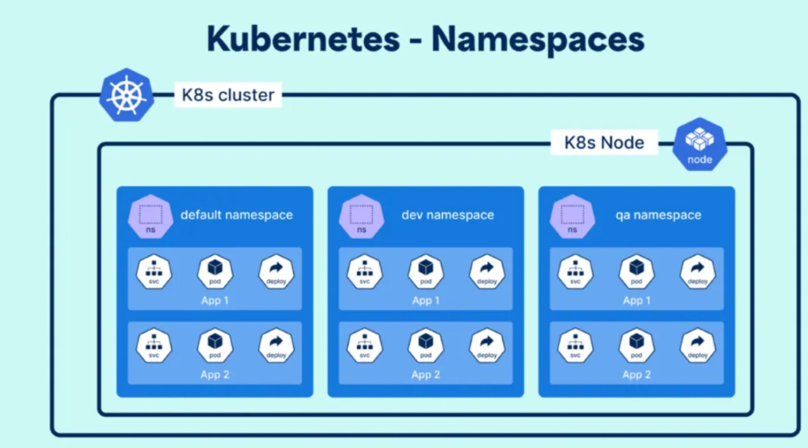

# Kubernetes Architecture
===================================================================== <br>

# Master Node <br>

**Control Plane Roles Relative to Namespaces** <br>
•&emsp;`kube-apiserver:` The absolute gatekeeper. Every single kubectl request passes here first. When you query a specific namespace, it evaluates your authorization permissions against that unique logical boundary before processing the request.<br>
•&emsp;`etcd:` The single source of truth database. It holds the ultimate structural state configuration for the entire system, mapping exactly which namespace tag belongs to each individual resource definition.<br>
•&emsp;`kube-scheduler:` The matchmaker. It scans for newly configured workloads via the API server and assigns them to an open Data Node based on hardware capacity. The scheduler does not isolate workloads physically by namespace unless you explicitly command it to via affinity policies.<br>
•&emsp;`kube-controller-manager:` The core driver loop. It continuously compares your cluster's current running state against your desired configuration (e.g., ensuring 3 replicas of a production pod remain functional). It operates globally but processes resources namespace-by-namespace. <br>
•&emsp;`cloud-controller-manager (CCM):` The external bridge. It links your cluster to cloud provider APIs (like AWS, Azure, or GCP). For example, when you provision a namespaced `Service` of type `LoadBalancer`, the CCM communicates outward to spin up a physical cloud balancer matching that isolated workload. <br>
**Role-Based Access Control (RBAC)** <br>
To secure your shared multi-tenant cluster (dev, qa, prod), you need to enforce boundaries at two levels: `Access Isolation` using Role-Based Access Control (RBAC) and `Resource Isolation` using Resource Quotas. <br>By default, the Master Node control plane components (`kube-apiserver`, `etcd`, `kube-scheduler`) are entirely locked down and accessible only by cluster administrators or core system processes. Developers interact *only* with the `kube-apiserver`. <br>
**1.&emsp; Restricting Developer Access via RBAC**<br>To prevent a developer working in the dev namespace from viewing or altering things in the prod namespace, you must define a Role (what can be done) and a RoleBinding (who can do it) scoped strictly to that namespace.<br>**Step A: Create a Namespace-Scoped Role**<br>This configuration grants permission to read and write application workloads, but restricts the user from altering administrative cluster infrastructure or crossing over to other namespaces. <br>
```hcl
apiVersion: rbac.authorization.k8s.io/v1
kind: Role
metadata:
  namespace: dev # Boundary limited strictly to the dev namespace
  name: developer-workload-manager
rules:
- apiGroups: [""] # Core API group
  resources: ["pods", "services", "configmaps", "secrets", "persistentvolumeclaims"]
  verbs: ["get", "list", "watch", "create", "update", "patch", "delete"]
- apiGroups: ["apps"] # Apps API group (Deployments, StateFulSets)
  resources: ["deployments", "replicasets", "statefulsets"]
  verbs: ["get", "list", "watch", "create", "update", "patch", "delete"]
```
**Step B: Bind the Role to a User or Group**<br>
This connects your specific developer identity to the namespace role created above. <br>
```hcl
apiVersion: v1
kind: ResourceQuota
metadata:
  name: dev-compute-quota
  namespace: dev # Placed directly inside the dev namespace
spec:
  hard:
    # Compute Restrictions
    requests.cpu: "4"         # Total CPU requests allowed across all dev pods
    requests.memory: 8Gi      # Total Memory requests allowed
    limits.cpu: "8"           # Max absolute CPU spike ceiling
    limits.memory: 16Gi       # Max absolute Memory spike ceiling
    
    # Object Count Restrictions
    pods: "10"                # Max number of concurrent running pods
    services: "5"             # Max services allowed
    persistentvolumeclaims: "4" # Max storage claims allowed

```
# Name Space <br>


# NameSpace Shared Infra <br>

